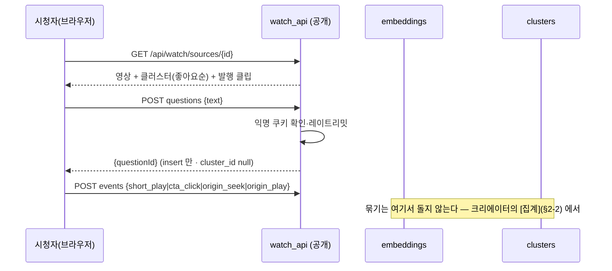
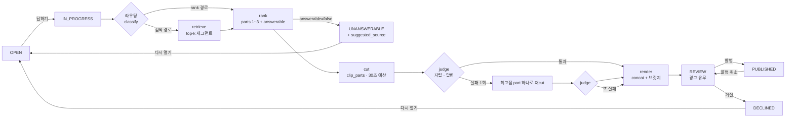

# TEASE 개발 실행 계획 — update_plan.md

**2026-09-05.** `tease.md` 가 *무엇을* 만들지라면, 이 문서는 *어떤 순서로, 어떤 단위로, 무엇을 확인하고
넘어가는지*다. 해커톤(원티드 AI 해커톤 2026, **D-day: ____ 채울 것**)까지 코드가 어디에 있어야 하는지를
마일스톤으로 자르고, 각 마일스톤에 **완료 조건(눈으로 확인)** 과 **지켜야 할 불변식(테스트)** 을 붙인다.

아티팩트 링크 : https://claude.ai/code/artifact/9a735021-812b-4a5d-8a6b-2ee37f469a49?via=auto_preview


| 알고 싶은 것 | 어디 |
|---|---|
| 제품·아키텍처·스키마 DDL·미결 사항 | [`tease.md`](tease.md) — 정본. 이 문서는 그것을 바꾸지 않는다 |
| 파이프라인 내부·규약 | [`make_shorts.md`](make_shorts.md) |
| 지금 상태·함정 | [`handoff.md`](handoff.md) |
| **개발 순서·완료 조건·상태 관리 방식** | **이 문서** |

표기: 🔴 치명 · **[결정]** 이 문서에서 정한 것 · **[tease 수정]** tease.md 에 반영해야 하는 어긋남

---

## 0. 원칙 — 얇게 관통하고, 상태는 한 곳에서

1. **얇게 관통 먼저.** 질문 등록 → 클러스터 → [답하기] → 단일 part 클립 → 발행 → `/watch` 재생까지
   **한 줄로 끝까지** 먼저 뚫는다(M1~M5a). 조합·judge·채널 검색은 그 위에 얹는다. make_shorts.md Phase A 가
   5분 조각으로 관통했던 것과 같은 이유다 — 끝까지 가 보기 전에는 무엇이 문제인지 모른다.
2. **상태 전이는 한 모듈에서만.** 클러스터 상태(§6-6)를 바꾸는 코드는 `tease/clusters.py` 의 `transition()`
   하나다. 허용된 간선 표가 코드에 있고, 표에 없는 전이는 예외다. 화면·API·잡 어디서도 `update … set status`
   를 직접 쓰지 않는다. **플로우가 복잡할수록 이 한 곳이 값을 한다.**
3. **잡 하나 = 고정 DAG 하나.** [답하기]는 `answer.run()` 한 함수가 라우팅→검색→rank→cut→judge→render 를
   순서대로 부른다. 에이전트가 다음 단계를 고르는 구조가 아니다(tease §5-7). 각 단계는 결과를 DB 에 쓰고
   `stage_calls` 에 남긴 뒤 다음으로 간다 — 중간에 죽어도 **어디까지 됐는지가 DB 에 있다.**
4. **인증 경계는 라우터 단위로.** 공개 라우터(`/api/watch/**`)와 스튜디오 라우터(`/api/**`)를 `APIRouter` 로
   나누고 `require_auth` 를 **라우터에** 건다. 엔드포인트마다 `Depends` 를 붙이는 지금 방식은 새 엔드포인트에서
   빠뜨리기 쉽다 — 라우터에 걸면 구조적으로 빠뜨릴 수 없다.
5. **마일스톤마다 handoff.md 를 갱신한다.** "지금 뭐가 있고 다음에 뭘 하나"가 항상 참이어야 한다.
6. **이름.** 패키지·레포·CLI 는 `shorts_maker`/`sm` 그대로 둔다. **TEASE** 는 제품 이름이라 화면 문자열과
   제출 문서에만 쓴다(`web/src/shared/brand.ts` 상수 하나). 해커톤 중에 레포를 개명하지 않는다.

---

## 1. 코드가 지금 어디 있나 — 계획의 출발점

`tease.md` 가 쓰인 뒤(9/3) 코드를 다시 읽고 확인한 것. 계획은 이 사실 위에 선다.

| 사실 | 계획에 미치는 영향 |
|---|---|
| `stt.py` 는 이미 `word_timestamps=True` 고 `utterances.words` 가 전 행 채워진다 | **[tease 수정]** §5-8 "켜기만 하면" 은 틀렸다 — 이미 켜져 있고, **cut 이 단어 경계를 쓰지 않는 것**이 남은 일이다(M8) |
| `stage_calls.stage` CHECK = `ping·chunk·stt·segment·describe·rank·cut·render` | v9 에서 재생성. 새 stage 는 tease §6-4 의 6개 + **`download`·`preview`** (지금 기록 안 되는 두 단계) |
| DB 는 비어 있다(9/4 리셋). 운영 서버에도 DB 가 없다 | v9 마이그레이션의 **위험이 0** 이다. 그래도 `MIGRATIONS[9]` 는 쓴다 — 새 DB 와 마이그레이션한 DB 의 `table_info` 일치 테스트가 앞으로의 안전망이다 |
| 화면 "다시 추출"은 청크를 **교체하지 않고 추가**한다. UI 는 `chunks[0]` 만 본다 | 두 청크가 생기면 rank 의 `[idx]` 가 충돌한다. **M0 에서 고친다** — 교체 semantics 로 |
| rank 가 `segments.excluded_by='auto'` 를 영구 기록한다. 읽는 곳 없음 | 중립 자산에 run 의 판정을 쓰는 것. **M0 에서 제거** — `runs.ranked.excluded` 에 이미 있다 |
| `sources.status` 는 아무도 RUNNING 으로 바꾸지 않는다 | M0 에서 download/register 잡이 채우게 한다(작은 일) |
| 유튜브 다운로드와 세그먼트 미리보기는 `stage_calls` 에 없다 | v9 stage 에 `download`·`preview` 추가하고 기록 |
| 미리보기 ffmpeg 가 잡 큐를 우회한다 | 스튜디오 전용이고 `-c copy` 라 가볍다. **그대로 둔다.** 문서에 "구조적 동시 1건" 의 예외로 적는다 |
| `api.py` 549줄에 인증·조회·잡·파일·SPA 가 한 파일 | M0 에서 라우터 분리(`http/server` + `http/studio`). 공개 면을 붙이기 **전에** 해야 한다 |
| `web/` 은 라우터 없음, `ShortsPage` 664줄 | M4 에서 `shared/studio/watch` 재배치 + react-router |
| tease §5-1 자막 우선은 make_shorts §1-2 실측(자동자막 타임스탬프 겹침)과 충돌 | **[결정]** VTT 대신 **`json3` 포맷**을 받는다 — 단어 단위 `tOffsetMs` 가 있어 겹침 문제가 없고 단어 타임스탬프까지 얻는다(M7). tease §5-1 을 이렇게 고친다 |

---

## 2. 전체 그림 — 두 플로우와 상태

### 2-1. 시청자 플로우 (`/watch`, 무인증)



**공개 경로의 외부 호출은 0회다.** 전부 INSERT/SELECT 다. 묶기는 크리에이터가 트리거한다(D11).

### 2-2. 크리에이터 플로우 (`/studio`, 인증) — [집계] 잡, 그리고 [답하기] 잡

**[집계]** (`kind='aggregate'`, 스튜디오가 영상을 열 때 자동 1회 + 버튼):

```
미분류 질문(cluster_id null) + 기존 클러스터 대표 문장
  → LLM 1회  : 새 그룹의 대표 문장만 뽑는다              [stage=cluster]  검증: 비어 있지 않음 · 기존과 중복 아님
  → 임베딩 1회: 대표 문장 + 미분류 질문을 배치로          [stage=embed]
  → 코사인    : 질문마다 가장 가까운 대표, ≥ θ 면 합류, 아니면 단독 클러스터(대표=원문)
  → SQL       : "N명이 궁금해함" = count(questions) + sum(likes)
```

🔴 LLM 은 **이름만** 짓는다. 소속은 임베딩, 개수는 SQL. 증분이라 기존 클러스터 id·좋아요는 보존된다.

**[답하기]** (`kind='answer'`):



한 잡(`kind='answer'`)이 `B → V` 를 끝까지 간다. 잡이 죽으면 재기동 시 `IN_PROGRESS → OPEN` (지금의
`RUNNING → FAILED` 정리와 같은 자리).

### 2-3. 상태 전이 표 — `clusters.transition()` 이 강제한다

| from \ to | OPEN | IN_PROGRESS | REVIEW | PUBLISHED | DECLINED | UNANSWERABLE |
|---|---|---|---|---|---|---|
| OPEN | | 답하기 | | | | |
| IN_PROGRESS | 잡 실패·재기동 | | 파이프라인 완료 | | | rank answerable=false |
| REVIEW | 다시 열기 | 다시 답하기 | | 발행 | 거절 | |
| PUBLISHED | | | 발행 취소 | | | |
| DECLINED | 다시 열기 | | | | | |
| UNANSWERABLE | 다시 열기 | | | | | |

빈 칸은 예외다. `tests/test_clusters.py` 가 이 표를 **전부** 돈다(36칸).

### 2-4. 불변식 — 어기면 데모가 아니라 제품이 틀린 것

| # | 불변식 | 지키는 곳 | 테스트 |
|---|---|---|---|
| I1 | 미발행 클립 파일은 공개 경로에서 **404** | `http/watch.get_clip_file` | `tests/http/test_watch.py` |
| I2 | `PUBLISHED` 클러스터 ↔ `published_at not null` 클립이 **정확히 1개** | `transition()` 이 발행 시 검사 | `test_clusters.py` |
| I3 | 같은 viewer 가 같은 질문에 좋아요 2회 불가 | `unique(question_id, viewer_id)` | `test_schema.py` |
| I4 | `clip_parts` 합 ≤ `SHORTS_TEASER_MAX_SEC` | `cutting.enforce_budget()` — LLM 이 말한 길이를 믿지 않는다 | `test_cutting.py` |
| I5 | part 의 발화 범위는 그 세그먼트 안, 초는 `utterances` 에서 | `ranking.parse_response` 화이트리스트 | `test_ranking.py` |
| I6 | 임베딩은 `(kind, ref_id, model)` 유니크 — 모델 바꾸면 섞이지 않음 | 스키마 | `test_schema.py` |
| I7 | 공개 쓰기 API 는 레이트리밋을 넘으면 **429** | `http/watch` 미들웨어 | `tests/http/test_watch.py` |
| I8 | 모든 새 stage 가 `stage_calls` 에 남는다 | 각 단계 | `test_answer.py` (mock Gemini 로 DAG 1회 돌려 행 수 확인) |
| I9 | 스튜디오 라우터의 **모든** 경로가 401 without cookie | 라우터 레벨 `require_auth` | `test_api_auth.py` — 라우트 테이블을 순회해 전부 친다 |
| I10 | 새 DB 와 v8→v9 마이그레이션 DB 의 `table_info` 가 같다 | `store.MIGRATIONS[9]` | `test_schema.py` |
| I11 | 공개 API 는 어떤 경로에서도 Gemini(임베딩 포함)를 부르지 않는다 | `http/watch` | `tests/http/test_watch.py` — gemini mock 호출 수 0 |
| I12 | 재집계 후에도 `questions.text`·기존 `cluster_id`·좋아요가 그대로 | `clusters.aggregate` 증분 | `test_clusters.py` |

---

## 3. 코드 배치 — 역할로 가른다 (2026-09-06 재편)

```
backend/src/shorts_maker/
  config.py · jobs.py · doctor.py · pricing.py          횡단 관심사
  http/                                                  FastAPI 만. 도메인 로직 없음
    server.py       앱 조립 · /auth/** · /health · /debug · SPA catch-all · serve()
    deps.py         cfg · 잡 큐 · require_auth · connect — 라우터들이 공유
    studio.py       크리에이터 /api/** (APIRouter, 라우터 레벨 인증)
    watch.py        (M3) 시청자 /api/watch/** — 별도 라우터, 인증 없음, 발행된 것만
    auth.py · debug_page.py
  pipeline/                                              기존 5단계. 확장하되 옮기지 않는다
    ingest · stt · segmentation · ranking · cutting · render · media · subtitles · orchestrate(run_all)
  answers/                                               시청자 질문 → 답 클립. 제품명(TEASE)은 코드에 안 쓴다
    embeddings.py   embed_texts() · store/load(kind, ref_id) · cosine_topk()          [stage=embed]
    clusters.py     aggregate()([집계]) · transition() · 상태표                          [stage=cluster]
    routing.py      classify(canonical) -> 'retrieval' | 'rank'                        [stage=classify]
    retrieval.py    candidates(cluster) -> 세그먼트 top-k (이 영상 → 같은 channel)     [stage=retrieve]
    judge.py        judge(parts_text, question) -> {standalone, answers, reason}       [stage=judge]
    answer.py       run(cluster_id) — 고정 DAG. 위 모듈들을 순서대로 부른다
    events.py       viewer_events 적재 · 퍼널 집계(insights)
    viewers.py      익명 쿠키 발급·확인 · 레이트리밋(메모리)
  adapters/                                              프로세스 밖과 말하는 것만
    ffmpeg.py · gemini.py · ytdlp.py
  db/
    store.py        psycopg 풀 · connect() · apply_schema() · reset()
    migrations/     001_baseline.sql (= 옛 SQLite v9 내용) · 이후 NNN_*.sql 덧붙이기
  cli/main.py       `sm`
backend/tests/      src 를 미러링(http/ pipeline/ adapters/ db/). support.py — 테스트 DB(shorts_test)·make_config
backend/eval/
    questions.yaml  §10-3 질문 세트 (유형·기대·붙어야 할 클러스터)
web/src/
  shared/   client · types · hooks · brand.ts · 공통 CSS
  studio/   기존 ShortsPage → SourcePage + ClusterPanel + InsightsPage
  watch/    HomePage · WatchPage(iframe · QuestionPanel · ShortsRow · CTA)
  App.tsx   react-router, React.lazy 로 두 트리 분리
```

**왜 역할별인가.** 처음엔 `tease/` 서브패키지 하나를 옆에 붙이려 했다. 그러면 반년 뒤 "tease 안에 있는 것과
밖에 있는 것의 기준"을 아무도 설명 못 한다 — TEASE 는 부가 기능이 아니라 제품이다. HTTP · 파이프라인 · 답변 ·
어댑터 · DB 로 가르면 새 파일이 어디 가야 하는지 이름만 보고 안다. 의존 방향은 한쪽이다:
http → pipeline/answers → adapters·db. `pipeline/` 의 `ranking`·`cutting`·`render` 는 **확장**하되(parts·budget·concat)
그 자리에 둔다.

---

## 4. 마일스톤

크기: S(반나절) · M(하루) · L(이틀). 혼자면 순서대로, 둘이면 §5 의 병렬 트랙.
**컷 라인**: M0~M6 이 데모(§10-2 시나리오 1~8)의 필수다. M7·M8 은 있으면 좋은 것. M9 는 반드시.

### M0 — 정리와 결정 (S) 🔴 먼저 — **완료 2026-09-06**

**목적**: 뒤의 마일스톤이 깨진 바닥 위에 서지 않게 한다.

- [x] tease.md §13 미결 9개에 **[결정]** 기록. 권고대로 — 표의 "권고" 열이 "결정" 이 됐다.
      추가 결정 4개는 §6 참조
- [x] `api.py` → `api.py`(앱 조립·공개 라우트) + `studio_api.py`(APIRouter `/api`, 라우터 레벨 `require_auth`)
      + `deps.py`(cfg·queue·require_auth — 두 모듈이 공유하는 것. 순환 import 를 피하려고 뺐다). 동작 변화 0.
      `test_api_auth.py` 에 **라우트 테이블 순회 테스트** — 스튜디오 라우터의 모든 라우트×메서드가 401,
      앱의 모든 `/api/**` 는 스튜디오 라우터 소속, 공개 라우트는 정확히 6개(`/auth/*` 3 · `/health` · `/debug` · catch-all)
- [x] "다시 추출" → **교체**. `ingest.add_chunk(replace=True)` 가 기존 청크(+cascade: 발화·구간·클립)와
      **그 소스의 run** 을 지우고 같은 idx 로 만든다. run 은 chunks 에 매달려 있지 않아 따로 지운다 — 남기면
      `runs.ranked` 가 사라진 구간 idx 를 가리킨다. 추출을 먼저 하고 지운다(실패하면 옛 전사가 남는다).
      화면 버튼·`sm chunk add --replace` 가 넘긴다. replace 없이 두 번째 청크는 API 409 · CLI IngestError
- [x] `ranking.run_for_source` 의 `update segments set excluded_by='auto'` 제거. 제외 목록은 `runs.ranked` 에만.
      컬럼은 'human' 용도로 남긴다(스키마 변경은 M1)
- [x] `download`·`register` 잡이 `sources.status` 를 RUNNING→DONE/FAILED 로. `ingest.begin_source`(행을
      `pending:` 지문으로 먼저) → `finish_source`(길이·sha256·DONE). 실패는 FAILED+error 로 남고, 같은 경로
      재시도는 **같은 id** 를 다시 쓴다. 같은 내용을 다른 파일명으로 넣으면 행을 지우고 거절(유령 행 방지).
      `download.fetch` 를 `probe`/`target_path`/`fetch_video` 로 갈라 다운로드 전에 경로를 안다
- [x] `web/src/shared/brand.ts`: `PRODUCT_NAME = "TEASE"`, `REPO_NAME = "shorts_maker"`. 제목 2곳 + index.html
- [x] `numpy` 의존성 추가(임베딩 코사인). 근거: `frombuffer` + 행렬곱 한 줄 — 순수 파이썬 루프는 세그먼트 수백 ×
      질문 수백에서 이미 수십 ms 다

**완료 조건**: 테스트 전부 통과(151) · 화면에서 기존 파이프라인 5단계가 그대로 돈다 · `git log` 에 M0 커밋

### M1 — 스키마 v9 → **Postgres 기준 스키마** (M) — **완료 2026-09-06**

원래 계획은 SQLite 위에서 v9 마이그레이션(테이블 재생성 곡예 포함)이었다. 그걸 다 짠 뒤(멱등 재생성·DDL 파서·
테스트 15건) **Postgres 로 전환하기로 결정**했고(D5 번복, §6), 그 코드는 버리고 v9 내용을 Postgres 기준 스키마
`db/migrations/001_baseline.sql` 로 옮겼다. 파일 구조 재편(§3)도 같이 했다.

- [x] `db/store.py` — psycopg 3 풀, `connect(url)` 컨텍스트 매니저(commit/rollback), `apply_schema()` 가
      `migrations/NNN_*.sql` 을 번호 순으로 파일당 트랜잭션 하나로 적용. `SCHEMA_VERSION` 은 파일 번호의 최댓값
- [x] `001_baseline.sql` — tease §6 의 전부. 달라진 것: timestamptz · jsonb(ranked·words·params·chapters·payload) ·
      boolean(rendered·describe_failed·published) · bytea · identity id. **CHECK 를 전부 건다** — Postgres 는
      나중에 ALTER 로 바꿀 수 있어 "새 컬럼엔 CHECK 를 못 건다"는 규칙이 사라졌다. `stage_calls` CHECK 에
      `caption·embed·retrieve·cluster·judge·classify` + **`download·preview`**. `clip_reviews.reviewer` 도 CHECK
- [x] 전 모듈 SQL 전환: `?`→`%s` · `lastrowid`→`returning id` · `datetime('now')`→`now()` · JSON 은 `Jsonb()` ·
      `IntegrityError` 는 `constraint_name` 으로 판별. 긴 계산(STT·렌더·지문) 앞에서 `commit()`
- [x] compose 에 `db` 서비스(postgres:17-alpine, 127.0.0.1:5432, `shorts-pg` 볼륨). 앱은 `depends_on: service_healthy`.
      `.env` 에 `POSTGRES_PASSWORD` 필수(두 서비스가 같은 env_file 로 같은 값을 본다)
- [x] 테스트는 **진짜 Postgres**(`shorts_test`, 테스트마다 truncate). 없으면 skip + 경고. `tests/support.DbTestCase`
- [x] `sm db init/status/reset` 이 Postgres 에 맞게. `reset` 은 public 스키마를 통째로 지운다
- [x] `download`(from-url 잡)·`preview`(미리보기 신규 생성)를 `stage_calls` 에 기록(D8)

**완료 조건**: ✅ `sm db status` v1 · 14 테이블 · `sm doctor` 전 항목 ok · 테스트 166개 통과(skip 0) ·
컨테이너에서 파이프라인 전 단계 실행 확인(2026-09-06).
**tease 수정**: §6-4(재생성)는 Postgres 에선 해당 없음 — 주석으로 남김. §5-3 sqlite-vec → pgvector.

### M2 — 시청자 면: 공개 API + `/watch` 화면 (L) — **완료 2026-09-06**

**순서를 바꿨다.** 원래 M2 는 임베딩·클러스터였는데, 질문 등록은 insert 만이라(D11) 임베딩에
의존하지 않는다 — 계획의 순서가 틀렸다. 오히려 반대다: 묶기 임계값 θ 를 튜닝하려면 **실제로 쌓인
질문**이 필요한데, 손으로 적은 `eval/questions.yaml` 은 사람이 쓴 문장과 표현이 다르다. 시청자 면을
먼저 열면 진짜 데이터로 튜닝한다. 공개 면의 위험(무인증 라우터·익명 쿠키·레이트리밋)이 앞으로 오는
것도 이득이다 — 틀리면 조용히 뚫리는 것들이라 일찍 테스트로 굳히는 게 낫다.

- [x] `answers/viewers.py` — `sm_viewer` 쿠키(UUID4 · httpOnly · SameSite=lax · 1년). 🔴 값이 UUID 모양이
      아니면 새로 발급한다(남이 정한 문자열이 viewer_id 로 DB 에 들어가는 걸 막는다). 레이트리밋:
      viewer 당 질문 5/분 · 좋아요 30/분, IP 당 ×3, 넘으면 429. IP 는 **`X-Real-IP` 만** 믿는다 — nginx 가
      덮어쓰는 헤더다. `X-Forwarded-For` 는 클라이언트 값 뒤에 덧붙는 형태라 위조로 한도를 피할 수 있다
- [x] `http/watch.py` — 인증 의존성 **없는** 별도 라우터. 라우터 레벨 의존성은 쿠키 발급뿐이라
      목록만 봐도 시청자 id 가 생긴다. 읽기는 전부 `published` 조건, 미발행은 **404**(403 아님)
- [x] 🔴 질문 등록은 **insert 만** — 임베딩도 LLM 도 없다(D11). 테스트: Gemini mock 이 한 번도 안 불리고,
      `GEMINI_API_KEY` 를 비운 채로도 공개 면 전체가 동작한다
- [x] 좋아요는 **토글**. `likedByMe` 를 서버가 계산해 준다 — 쿠키가 httpOnly 라 브라우저가 자기 id 를 못 읽는다
- [x] `answers/events.py` — `question_post`·`like` 는 **서버가** 넣고, 클라이언트는 `KIND_FROM_CLIENT`
      (재생·완주·CTA·원본 이동)만 보낼 수 있다. 🔴 클라이언트가 서버 이벤트를 위조하면 퍼널이 거짓이 된다
- [x] 스튜디오 `POST /api/sources/{id}/publish` · `/unpublish`. 발행은 `status='DONE'` 일 때만
- [x] URL 등록이 `youtube_id`·`channel` 을 저장한다(`ytdlp.probe` 가 준다). 🔴 `origin` 문자열을 나중에
      파싱해서 되찾지 않는다 — 형식이 바뀌면 조용히 깨진다
- [x] `web/` 재배치: `shared/`(client·useAsync·brand·styles) · `studio/` · `watch/`. react-router 도입,
      두 트리를 `React.lazy` 로 분리 — 🔴 번들이 아니라 **인증** 때문이다. 한 트리면 시청자도 `/auth/me` 를
      부르고 로그인 화면이 번쩍인다. 실측: watch 6.4KB / studio 22.6KB 로 갈렸다
- [x] `/watch` 목록(썸네일·질문 수) · `/watch/:id` 상세(유튜브 임베드 · 질문 작성 200자 · 질문 목록 · 좋아요)
- [x] 테스트 `tests/http/test_watch.py` 25개 + 인증 경계 테스트 확장(두 라우터가 겹치지 않는가,
      공개 라우터의 경로가 전부 `/api/watch/` 인가, 공개 라우터가 무인증으로 닿는가)

**완료 조건**: ✅ 테스트 194개 통과 · 컨테이너에서 비공개 404 → 발행 → 질문·좋아요·이벤트 확인(2026-09-06).
**남은 것**: 클립 줄(`/watch` 의 숏폼)은 M4 에서 붙는다 — 지금은 발행된 클립이 없어 빈 배열이다.

### M3 — 임베딩·클러스터 (M~L) — **완료 2026-09-06**

- [x] `answers/embeddings.py` — `gemini.embed_texts(cfg, texts, task_type)` 배치 호출, `stage_calls(stage='embed')`.
      float32 LE blob. 🔴 **저장 직전에 정규화한다** — gemini-embedding-001 은 3072 이 아닌 차원을 요청하면
      정규화되지 않은 벡터를 준다. 안 하면 내적이 코사인이 아니게 되고 θ 가 조용히 의미를 잃는다
- [x] 🔴 **마이그레이션 002** — `embeddings.task_type` 을 유니크 키에 넣었다. 클러스터 대표 문장은 묶기용
      (`SEMANTIC_SIMILARITY`)과 검색용(`RETRIEVAL_QUERY`, M5) 벡터를 **둘 다** 가져야 하는데, 001 의
      `unique (kind, ref_id, model)` 로는 하나가 조용히 덮인다. (SQLite 였다면 테이블 재생성이었다)
- [x] `answers/clusters.aggregate()` — **[집계] 잡.** ① LLM 1회로 **새 대표 문장만** `[stage=cluster]`
      (검증: 빈 문자열·기존과 중복·길이·개수 상한) ② 대표 문장 + 미분류 질문 배치 임베딩 `[stage=embed]`
      ③ 최근접 대표에 코사인 ≥ θ 면 합류, 아니면 그 질문이 곧 새 클러스터. 🔴 단독 클러스터는 만들어지는
      즉시 후보 목록에 들어간다 — 없으면 LLM 이 놓친 표현이 전부 1개짜리로 흩어진다
- [x] 🔴 LLM 에게 소속·개수를 시키지 않는다. 프롬프트에 번호를 붙여 보내지도 않는다(번호가 있으면 모델이
      지목하고 싶어진다). 개수는 `clusters.demand()` 의 SQL. 재집계는 증분 — `cluster_id` 가 있는 질문은
      건드리지 않는다(I12, 테스트로 고정)
- [x] LLM 이 제안했지만 아무도 안 붙은 대표 문장은 그 실행에서 만든 것에 한해 지운다(소음 제거)
- [x] 대표 문장 수정은 `PATCH /api/clusters/{id}` 로만. 자동 재작성 없음. 🔴 수정하면 벡터를 다시 계산한다
- [x] `clusters.transition()` + 상태표 + **36칸 테스트**. 재기동 시 `reopen_stuck()` 이 IN_PROGRESS 를 OPEN 으로
- [x] 스튜디오 API: `POST /api/sources/{id}/aggregate` · `GET /api/sources/{id}/clusters` · `PATCH /api/clusters/{id}`
- [x] 스튜디오 화면: 클러스터 패널([집계] 버튼 · 수요 순 목록 · 원문 펼치기 · 대표 문장 인라인 수정 · 미분류 목록)
- [x] **평가 CLI** `sm answers eval-cluster <source> [--theta] [--keep]` + `backend/eval/questions.json`.
      🔴 실제 API 호출이 나간다. 🔴 실행 전 소속을 스냅숏하고 끝나면 되돌린다 — 처음엔 안 했다가 사용자의
      진짜 질문 하나가 평가용 클러스터에 묶였다(테스트로 고정). yaml 대신 json 인 이유는 의존성을 늘리지 않으려고

**θ 측정 결과 (질문 23개, 2026-09-06):**

| θ | 클러스터 수 | 잘못 섞임 | 판단 |
|---|---|---|---|
| 0.60 | 10 | 0 | 무관한 질문도 아직 단독. 하한이 안 잡힘 |
| 0.75 | 10 | 0 | 0.60 과 결과 동일 — 넓은 안정 구간 |
| **0.85** | **12** | **0** | **기본값.** 무관한 질문 단독, 쪼개진 3개는 전부 defensible |
| 0.92 | 17 | 0 | 23개 중 17개가 단독 — 사실상 묶이지 않는다. 상한 |

**배운 것**: θ 는 민감한 변수가 아니었다. 묶기 품질의 대부분은 **LLM 의 대표 문장 짓기**가 결정하고, θ 는
"붙일까 혼자 둘까"만 가른다. 높은 쪽을 택한 근거는 실패 비용의 비대칭 — 잘못 붙은 건 대표 문장만 보는
크리에이터의 눈에 안 띄고, 안 붙은 건 단독 클러스터로 목록에 보인다.
**평가 세트의 한계**: 이 표는 묶기(θ)와 이름짓기(LLM)를 구분하지 못한다. 숫자보다 대표 문장을 읽어야 한다.

**완료 조건**: ✅ 테스트 통과 · 실제 Gemini 로 θ 표 작성 · 사용자의 진짜 질문 1개가 [집계]로 묶이는 것 확인.

### (옛 M3 — 공개 API) → **M2 에 흡수됨**

공개 라우터·익명 쿠키·레이트리밋·이벤트는 M2 에서 다 했다. 여기 있던 항목 중 남은 것 하나는
`GET /api/watch/clips/{id}/file`(발행 클립만) 인데, 엔드포인트와 테스트는 M2 에서 만들었고 실제로
클립이 발행되는 건 M4 다.

### M4 — `web/` 재배치 + `/watch` 화면 (L) — **대부분 완료 2026-09-08, 원본 유입 경로 남음**

M1 이 끝나면 M2·M3 과 **병렬 가능**(타입만 먼저 맞추면 API 는 mock 으로).

- [x] `react-router` 추가. `App.tsx` = 라우터 + `React.lazy(studio)` / `React.lazy(watch)`
      🔴 **경로가 tease §8-2 와 반대로 갔다** — 스튜디오가 `/*`, 시청자가 `/watch/*` 다. 즉 `/` 로 들어온
      시청자가 스튜디오 로그인 화면을 만난다. 데모가 시청자 화면에서 시작하므로 M9 전에 정한다(D12)
- [x] `shared/`: `client.ts`·`types.ts`·`useAsync`·CSS·`brand.ts`
- [x] `studio/`: 기존 `ShortsPage` 분해. 홈(영상 목록) + 영상별 페이지 + 탭 넷(질문·클립·영상 준비·기록)
- [x] `watch/HomePage`: 발행 영상 카드. `watch/SourcePage`: 임베드 + 질문 패널 + 숏폼 줄(오른쪽 열)
- [x] 🔴 **유튜브 IFrame Player API + 숏폼 끝 CTA → `player.seekTo()`** — 완료 2026-09-09.
      `watch/youtube.ts`(API 로더, 전역 콜백 하나를 약속으로 감싼다) + `watch/OriginPlayer.tsx`
      (`youtube-nocookie.com` · `enablejsapi=1` · `onStateChange`). 클립 payload 에 `start_sec` 을
      실어 보낸다 — 소스 절대 초라 플레이어 타임라인에 그대로 들어간다.
      🔴 API 스크립트가 막히면(광고 차단기·회사망) 평범한 임베드로 물러나고, CTA 는 `t=` 를 붙인
      유튜브 링크를 새 탭으로 연다. 그때 `origin_seek` 은 남기지 않는다 — 새 탭의 재생은 관측할 수 없고,
      관측 못 하는 것을 퍼널에 넣으면 뒤 칸이 영원히 비어 보인다
- [x] 계측 7종 전부 발생 — 완료 2026-09-09. `origin_seek`(seekTo 성공 직후) · `origin_play`
      (CTA 후 30초 창 안의 PLAYING, D10) 이 붙었다. `like` 는 질문이 아는 `source_id` 를 넣는다.
      `cta_click` 은 **숏폼 CTA 에만** 붙인다 — 페이지 아래 "유튜브에서 보기" 링크에서 뗐다.
      숏폼을 안 본 사람이 섞이면 CTA 가 재생보다 많아져 퍼널이 거짓이 된다
- [x] 🔴 `viewer_events.clip_id` 를 **최상위로** 보낸다 — 완료 2026-09-09. 프론트가 `payload` 안에
      넣고 서버는 최상위를 읽어서 그 컬럼이 한 줄도 채워지지 않았다(`idx_events_clip` 은 죽은 인덱스였다).
      같이 고친 것: 공개 이벤트 라우트가 `sourceId`·`clipId` 를 **검증한다**. 인증이 없는 면인데 없는 id 를
      그대로 insert 하면 외래키 위반이 500 으로 새어 나갔다 — 이제 404 다
- [ ] 🔴 `useAsync` 의 "로딩 중 data=null 깜빡임" 은 `/watch` 에서 눈에 띈다 — 이전 data 를 유지하는 옵션 추가

**완료 조건**: `/watch/1` 에서 질문을 적으면 패널에 즉시 나타나고 ✅, 발행 클립을 틀고 CTA 를 누르면 같은 페이지의
유튜브 플레이어가 그 초로 이동한다 ✅(코드 완료 2026-09-09, **브라우저 확인 남음**). 이벤트 7종이
`viewer_events` 에 쌓인다 ✅. 남은 것은 `useAsync` 깜빡임 하나다.
**리스크**: 원티드 영상 임베드 차단 → 허락 때 확인. 안 되면 `<video>` 로 원본 직접 서빙(파일은 있다).

### M4.5 — 긴 영상 자동 분할 (S) — **완료 2026-09-06** 🔴 계획에 없던 것

**왜 끼어들었나.** M5 검증용으로 95분 채용설명회를 전사하다 컨테이너가 OOM(exit 137)으로 죽었다.
whisper 메모리가 전사 길이에 비례한다 — 실측 30분 = 1.4GB, 95분 ≈ 4GB > 한도 2.93GB.

**한도를 올리지 않기로 했다.** 로컬은 올릴 수 있지만(Docker VM 7.7GB) 운영이 4GB VM 이라 거기서 막힌다.
청크는 원래 이걸 위해 설계에 있던 개념이고(`Source = 원본 전체, Chunk = 실제로 처리할 조각`),
M0 에서 내가 "LECTURE 는 소스당 청크 1개" 로 못박은 게 20분 강연에만 맞는 규칙이었다.

- [x] `ingest.plan_chunks(duration, max_sec, silences)` — 균등 분할 + **무음 지점 스냅**.
      고정 길이로 자르면 문장 한복판에서 끊겨 그 발화가 양쪽 청크에서 반토막 난다.
      `ffmpeg.detect_silences` 는 best-effort — 실패하면 고정 길이로 떨어진다
- [x] `ingest.add_chunks(source_id, replace)` — 사용자에게는 "구간 추출" 한 번. 🔴 사용자가 구간을 고르지 않는다
- [x] `stt.run_for_source` · `segmentation.run_for_source` — 청크를 순서대로. STT 는 이미 된 청크를 건너뛰어
      중간 실패 후 이어서 갈 수 있다
- [x] 🔴 `segments.idx` 를 **소스 안에서 연속**으로. rank 프롬프트가 번호로 지목하는데 청크마다 0부터면
      같은 번호가 둘이 된다. 부분 재분할 경로는 없앴다(전체를 다시 나눈다)
- [x] API·CLI 를 소스 단위로: `POST /api/sources/{id}/chunks|stt|segment`, `sm chunk add <source> [--replace]`,
      `sm stt run <source>`, `sm segment run <source>`
- [x] 화면은 합쳐서 보여준다 — 조각 수는 접어둔 상세로만. 사용자는 **범위**만 고르고(끝 칸의 기본값이
      영상 전체 길이), 조각 수는 코드가 정한다
- [x] 🔴 `store.source_lock` — 같은 원본의 긴 작업은 한 번에 하나. 전사 중 재분할이 들어와 외래키
      위반으로 죽은 뒤에 넣었다(§4-11). 어드바이저리 락이라 연결이 끊기면 자동으로 풀린다 —
      상태 컬럼이면 프로세스가 죽었을 때 손으로 치워야 한다
- [x] 상한을 **30분**으로(1800s). 95분이면 어느 쪽이든 4조각이고, 실측 메모리는 1.4GB(30분) < 2.93GB

**완료 조건**: 95분 영상이 4조각으로 나뉘어 전사되고, 화면에는 영상 하나로 보인다.
**남은 것**: 청크 경계에서 발화 하나가 잘릴 수 있다(무음 스냅이 완화하지만 없애지는 못한다).
겹침(overlap) + 중복 제거는 필요해지면 그때. 그리고 CLI 가 잡 큐를 우회하는 구조는 그대로다 —
락으로 파괴적 동시 실행만 막았고, 워커를 별도 프로세스로 빼는 건 서비스 전환의 일이다.

### M5 — [답하기] 파이프라인 — **코드 완료 2026-09-06, 실데이터 검증 남음**

**계획을 하나 바꿨다: bounded retry → best-of-3.** 원래는 "하나 만들고 judge 가 떨어뜨리면 최고점 part
하나로 줄여 1회 재시도" 였다. 순차라 느리고, 두 번째 시도가 첫 번째보다 낫다는 보장도 없었다.
지금은 **rank 가 후보 3개를 한 번에 내고 judge 가 병렬로 판정해 고른다.** judge 가 영상이 아니라
**텍스트**를 보기 때문에 가능하다 — 렌더 없이 셋을 판정하고 이긴 것 하나만 렌더한다.
비용은 LLM 4회(rank 1 + judge 3), 체감 시간은 judge 1회와 같다.

- [x] `answers/routing.classify()` — LLM 1회 `[stage=classify]` → `runs.route`. 규칙 기반 판정도 `params` 에
      함께 남겨 "규칙만으로 충분했나" 를 나중에 데이터로 답한다. 판정 실패는 검색 경로로 떨어뜨린다
- [x] `answers/retrieval.candidates()` — 클러스터 대표 문장을 **검색어로 다시 임베딩**(`RETRIEVAL_QUERY`,
      묶기용 벡터와 다르다 — 마이그레이션 002 가 갈라 둔 이유) → 세그먼트 코사인 top-k `[stage=retrieve]`.
      🔴 같은 채널의 다른 영상은 **안내용**으로만 본다(`suggested_source_id`). 다른 영상에서 클립을 만들면
      "이 클립은 어느 영상 것인가" 가 어디서도 답이 안 된다
- [x] `ranking.plan_answer()` — 기존 `run_for_source`(기준 rank)는 **그대로 살아 있다**. 답하기용은 별도 함수다.
      🔴 프롬프트 전용 **연속 번호**를 새로 매긴다 — `utterances.idx` 는 청크 안에서 0부터라 청크가 여럿이면
      같은 번호가 둘이 된다. 검증: 존재하는 번호 · 같은 구간 안(조각은 시간상 연속) · 순서 · 겹침 없음 · 1~3개
- [x] `cutting.enforce_budget()` — 뒤 조각부터 떨어뜨리고, 하나만 남아도 넘으면 **발화 단위로** 뒤를 자른다.
      🔴 초 단위로 자르면 말 중간에서 끊긴다. `create_answer_clip()` 이 `clip_parts` 와 `total_sec` 을 쓴다
- [x] `answers/judge.judge()` — 자립 + 답변 + 점수. 🔴 **DB 를 만지지 않는다** → 스레드로 병렬 판정 가능.
      조합 클립에는 "조각 사이에 안내가 뜬다" 를 알려준다(모르면 점프를 자립성 실패로 읽는다)
- [x] `ffmpeg.render_parts()` — **한 번의 인코딩**으로 concat. 조각별로 렌더해 데뮤서로 붙이면 코덱
      파라미터가 하나라도 어긋날 때 `-c copy` 가 조용히 싱크 틀어진 파일을 만든다. 브릿지 카드는
      검은 화면 0.4초 + 자막. `subtitles.build_part_cues()` 가 이어붙인 타임라인 기준으로 오프셋한다
- [x] `answers/answer.run()` — 고정 DAG. 실패하면 `transition(OPEN)` + `runs.error`
- [x] 스튜디오 API: `POST /api/clusters/{id}/answer` · `POST /api/clips/{id}/publish|unpublish`
- [x] 테스트 45개: DAG 순서 · 승자 선택(합격 우선, 그중 최고점) · 전부 불합격이면 REVIEW + llm NG ·
      실패 시 OPEN 복귀 · 예산이 judge **전에** 적용되는가 · 계획 검증 10건 · 자막 오프셋 5건
- [x] 합성 영상으로 concat 필터 실측: 4초 + 브릿지 0.4초 + 3초 = **7.40초**, 1080x1920, 48kHz 스테레오.
      브릿지 카드에 한글이 정상 렌더(두부 아님)

**남은 것**: 실제 영상으로 관통. 사용자가 전사를 돌린 뒤 [집계] → [답하기] → [발행] → `/watch` 확인.
**M5c(답변 불가 안내)** 는 코드가 들어갔지만(`suggested_source_id`) 화면은 M6 이고, 영상이 둘이어야 보인다.

- [ ] 🔴 **실데이터 관통이 아직 0회다**(2026-09-09). `clip_parts` 0행 — 조합 경로는 위 합성 실측이 전부다.
      실DB 의 OPEN 질문("쏘카에서 만드는 주요 프로덕트는 무엇인가요?") 이 첫 시험 대상이다
- [ ] 🔴 **판정이 질문을 너무 좁게 읽는다 — 실측 1건.** "쏘카 개발 직군의 주요 기술 스택" 질문에서
      검색은 정상이었다(best 0.755, 임계 0.5, 44 세그먼트 중 top-5). 그런데 판정이 "기술 영역·프로덕트는
      언급되지만 프로그래밍 언어·프레임워크는 없다" 며 답변 불가로 떨어뜨렸다. 영상엔 마이크로서비스
      아키텍처 · MLOps · 딥러닝 얘기가 있다. **검색 폭이 아니라 판정 기준의 문제다** — 관련 자료를 보고도
      거절했다. 프롬프트에 "질문의 핵심에 답이 되면 충분하다, 모든 세부까지 답할 필요는 없다" 를 넣는다.
      같은 영상의 복지·인재상 질문 둘은 내용이 정말 없어서 **정상 판정**이다(44개 세그먼트 설명 전수 확인)
- [ ] 위를 고친 뒤 `top_k`(현재 5/44)가 좁은지 다시 본다 — 판정을 먼저 풀지 않으면 top_k 를 늘려도
      같은 이유로 거절된다. 순서를 거꾸로 하면 원인을 못 가린다

### M6 — 루프 닫기: 스튜디오 [답하기]·[발행] + 시청자 숏폼 줄 (M) — **완료 2026-09-08**

**M5 까지 백엔드는 다 됐는데 화면이 비어 있었다.** 데모 시나리오 8단계 중 4개(답하기·발행·숏폼 노출·
원본 유입)가 엔드포인트만 있고 버튼이 없었다. 여기서 그 넷을 채워 **루프가 처음으로 닫힌다.**

- [x] 🔴 **질문 패널을 맨 위로.** 이 제품의 출발점은 시청자 질문인데 화면에서는 파이프라인 5단계와
      완성 클립을 다 지난 맨 아래에 있었다(697번째 줄). 순서가 제품과 반대였다. 파이프라인 단계는
      한 번 하고 마는 **준비**라서 아래로 내린다
- [x] 클러스터마다 상태에 맞는 것 하나: `OPEN` → [답하기] · `IN_PROGRESS` → 만드는 중 ·
      `REVIEW` → 클립 미리보기 + judge 소견 + [발행]/[보류] · `PUBLISHED` → [내리기] + /watch 링크 ·
      `UNANSWERABLE` → [다시 열기]
- [x] 🔴 **judge 판정을 발행 전에 보여준다.** NG 를 눈에 띄게(`--danger`) — 자립하지 않는다고 판정된
      클립이 조용히 발행되면 시청자가 먼저 발견한다. 이 화면이 존재하는 이유가 그걸 막는 것이다
- [x] 조합 클립이면 조각 수와 시간 범위를 보여준다 — **화면에 보이는 유일한 차별점**이다(tease §5-6)
- [x] 시청자 화면에 **답변 숏폼 줄**. 🔴 `/api/watch/clips/{id}/file` 로 (스튜디오 경로가 아니다).
      클립에 **그 질문**을 붙여 준다 — 클립만 보여주면 "이게 왜 여기 있지" 가 된다
- [x] 퍼널 이벤트 `short_play`·`short_complete` 연결. 🔴 iframe 안은 볼 수 없으므로 관측 가능한 것만 보낸다
- [x] 답할 수 없다고 판정된 질문 안내(+ 다른 편 링크). 🔴 **발행된 영상만** 가리킨다 — 미발행을
      가리키면 시청자가 404 로 간다
- [x] API 확장: `GET /api/sources/{id}/clusters` 가 클러스터별 클립 + judge 소견을,
      `GET /api/watch/sources/{id}` 가 클립의 질문과 `unanswerable` 을 준다 ✅ (백엔드 완료)

**완료 조건**: `/watch` 에서 남긴 질문이 스튜디오에 뜨고, [집계] → [답하기] → [발행] 을 거쳐 다시
`/watch` 에 숏폼으로 붙는다. **한 화면도 안 거치고 CLI 를 쓰지 않는다.**

🔴 **화면은 다 있지만 이 경로가 실데이터로 끝까지 돈 적이 없다.** 2026-09-09 기준 실DB: 질문 4개 →
클러스터 4개(OPEN 1 · UNANSWERABLE 3), 클립 1개는 **기준(criteria) 경로**로 뽑은 것이고 `clip_parts` 는 0행이다.
즉 [답하기]가 만든 클립이 아직 하나도 없고, 조합 렌더는 합성 데이터로만 검증됐다(M5 자기진단 참조).
남은 OPEN 질문("쏘카에서 만드는 주요 프로덕트는 무엇인가요?") 은 영상이 확실히 다루는 내용이라 이 경로의 첫 시험 대상이다.

### M6b — insights (S) — **완료 2026-09-09** (컷 라인 밖이었지만 M4 유입 경로와 같이 갔다)

**왜 같이 했나.** `origin_seek`·`origin_play` 를 붙여도 볼 화면이 없으면 그 계측이 실제로 도는지
확인할 방법이 DB 를 직접 조회하는 것뿐이다. 만든 것을 눈으로 볼 수 없으면 만든 게 아니다.

- [x] `GET /api/sources/{id}/insights` — `answers/events.funnel()`.
      🔴 **묶는 단위는 클러스터가 아니라 클립이다.** 계획엔 "클러스터별" 이라고 적었지만
      크리에이터가 자기 기준으로 뽑은 숏폼도 같은 목록에 발행되고 시청자에겐 구분 없이 보인다 —
      클러스터로 묶으면 그것들이 표에서 사라진다. 질문에서 나온 클립은 클러스터가 정확히 하나라
      (불변식 I1) 클립 단위가 클러스터 단위를 포함한다
- [x] 🔴 세는 단위는 **사람 수**(`count(distinct viewer_id)`)다. 같은 사람이 세 번 돌려 보면 이벤트는
      3줄이지만 본 사람은 1명이다 — 이벤트 수로 세면 앞 칸이 부풀어 유입률이 실제보다 낮아 보인다
- [x] 스튜디오 **기록 탭 맨 위**에 표. 🔴 비율을 쓰지 않는다 — 3명 중 1명이 33% 로 보이면 거짓말이다.
      계획의 `/studio/insights` 별도 라우트가 아니다: 퍼널은 영상별 값이라 영상 페이지 안에 있어야 하고,
      탭을 다섯째로 늘리는 대신 "기록" 을 성과 기록 + 작업 기록으로 읽었다. 접지 않는다 —
      "숏폼이 원본 유입을 만들었나" 는 디버깅 질문이 아니라 이 제품이 옳은지를 묻는 질문이다
- [x] 이벤트가 없는 발행 클립도 0 으로 표에 남긴다(left join) — 빠지면 "아무도 안 봤다" 와
      "발행된 적 없다" 가 구분되지 않는다

### M7 — 자막 우선 + 챕터 씨앗 (M) — 허락 후, 컷 라인 밖

- [ ] `yt-dlp --write-auto-sub --sub-lang ko --sub-format json3` → 파서 → `utterances`(단어 단위 `tOffsetMs` 로
      `words` 까지 채움) `[stage=caption]`. `sources.caption_source='youtube'`
- [ ] 없거나 파싱 실패 → whisper 폴백(지금 경로)
- [ ] `sources.chapters` 저장 → 분할 프롬프트 힌트. **측정**: 분할 경계 vs 챕터 경계 일치율을 `stage_calls.params` 에
- [ ] 테스트: json3 파서(겹침 없음 · 절대 초 · 빈 큐 제거) · 폴백 분기

**tease 수정**: §5-1 의 "VTT 파싱, 자막 큐 = 발화" → "json3, 단어 단위". make_shorts §1-2 실측과의 충돌이 해소된다.

### M8 — 단어 경계 cut + 캐싱 측정 (S) — 컷 라인 밖

- [ ] `cutting`: part 의 시작·끝을 발화 경계가 아니라 **첫·끝 단어 경계**로. 필러("음", "그러니까") 는 앞뒤 단어가
      필러 목록이면 뗀다. `clip_parts.start_sec/end_sec` 가 여기서 나온다
- [ ] 컨텍스트 캐싱: **rank 경로(전 세그먼트)에만** 시도. `stage_calls.cached_tokens` 전후 비교 표 → 이득 없으면 끈다.
      검색 경로는 프롬프트가 작아 대상이 아니다(tease §5-8 ⚠️)

### M9 — 데모 리허설 + 제출 (M) 🔴 반드시

- [ ] `sm tease seed --source N` — `eval/questions.yaml` 의 질문을 좋아요 수와 함께 미리 등록. 시나리오 4·6 이외는 **미리 발행**
- [ ] 두 영상(ep.45 + 면접 편, 또는 허락 전이면 니체 강연 2편) 등록·STT·분할·임베딩 완료 상태의 **볼륨 백업**
      (`docker compose exec db pg_dump -U shorts shorts > demo.sql`)
- [ ] 시나리오 1~8 을 시간 재며 3회. 라이브 구간(4·6)의 소요 시간 기록
- [ ] Gemini 장애 시 시나리오(1·3·5·7 만) 리허설 1회
- [ ] 제출 문서: tease §11 의 세 절을 채우고, §5-9 "하지 않는 것" 을 그대로 싣는다. 용어는 "retrieval-augmented selection",
      "bounded judge-retry loop" — 에이전트 하네스라고 쓰지 않는다
- [ ] handoff.md 를 "데모 상태" 기준으로 갱신

---

## 5. 두 명일 때의 병렬 트랙

```
       M0 ──► M1 ──┬──► M2 ──► M5a ──► M5b ──► M5c ──► M6(백엔드) ──► M9
                   │                                       ▲
                   └──► M3 ──► M4 ─────────────────────────┘  (M6 화면)
```

- **A(백엔드)**: M0 → M1 → M2 → M5a → M5b → M5c → M6 API → M7/M8
- **B(웹)**: M0 의 brand · M4 (M1 의 타입이 나오는 대로) → M3 와 맞물려 `/watch` → M6 화면
- 만나는 지점: **M5a 완료 = 루프가 닫힘.** 여기서 첫 통합 리허설.
- 혼자면 위 그림을 왼쪽에서 오른쪽으로. M4 는 M3 직후.

---

## 6. 결정 — tease §13 에 더해 이 문서가 정하는 것

| # | 결정 | 근거 |
|---|---|---|
| D1 | tease §13 의 9개는 **권고대로** 간다 | 각 권고에 근거가 달려 있고, 반대할 새 정보가 없다. M0 에서 표에 날짜를 적는다 |
| D2 | 자막은 VTT 가 아니라 **json3** | 자동자막 VTT 는 롤링 윈도로 타임스탬프가 겹쳐 쓸 수 없다(make_shorts §1-2 실측). json3 은 단어 단위 오프셋이라 겹침이 없고 단어 타임스탬프까지 준다 |
| D3 | `numpy` 도입 | 코사인 top-k 를 행렬곱 한 줄로. 순수 파이썬은 질문×세그먼트 곱에서 이미 느리다. 벡터 DB 는 여전히 안 쓴다 |
| D4 | 브릿지 카드는 **ASS** 로 | libass 는 이미 필수 의존이고 `sm doctor` 가 확인한다. `drawtext` 는 빌드마다 유무가 갈린다 |
| D5 | ~~Postgres(C5)는 해커톤 뒤~~ → **번복(2026-09-06): 지금 전환.** M1 직후, M2 전 | 해커톤 뒤 서비스로 갈 것이 확정이라 SQL 이 가장 적은 지금이 가장 싸다(코드 113곳). SQLite 는 CHECK·제약을 ALTER 로 못 바꿔 v9 에서 이미 재생성 곡예가 필요했고, 서비스가 되면 잡 워커 분리(`SKIP LOCKED`)와 사용자 스코프가 필요한데 둘 다 Postgres 가 답이다. ORM 은 안 넣는다 |
| D6 | 라우터 분리 + 라우터 레벨 인증(M0) | 공개 면을 붙이기 전에 경계를 구조로 만든다. 엔드포인트마다 `Depends` 는 빠뜨리기 쉽다 |
| D7 | 클러스터 상태 변경은 `transition()` 만 | 플로우 관리의 핵심. §2-3 표가 코드와 테스트에 그대로 있다 |
| D8 | 새 stage 에 `download`·`preview` 포함 | "모든 단계는 stage_calls" 규약의 구멍 둘을 v9 재생성에 얹어 한 번에 막는다 |
| D9 | 레포·패키지 이름 유지, TEASE 는 화면·문서 | 해커톤 중 개명은 위험만 있고 이득이 없다 |
| D10 | `/watch` 의 `origin_play` 는 CTA 후 30초 창 안의 PLAYING 만 | 시청자가 원래 보던 재생을 유입으로 세면 지표가 거짓이 된다 |
| D11 | 질문 묶기는 **크리에이터가 트리거하는 [집계]** 로. 질문 등록 시엔 insert 만 | 공개 경로에서 요청마다 외부 API 를 부르면 공격면이다. 제품 정의상 취합은 크리에이터의 행동. LLM 은 대표 문장만, 소속은 임베딩, 개수는 SQL — LLM 에게 인덱스·개수를 시키면 틀린다 (2026-09-05) |
| D12 | **미결(2026-09-09).** 라우트 배치를 tease §8-2(시청자 `/`, 스튜디오 `/studio`)로 되돌릴지, 코드 현행(스튜디오 `/`, 시청자 `/watch`)을 명세로 승격할지 | 데모 시나리오는 시청자 화면에서 시작한다. 지금 `/` 는 로그인 게이트라 첫 화면이 어긋난다. 되돌리면 스튜디오 북마크가 깨지고, 승격하면 "시청자가 주인인 면"이라는 제품 전제와 주소가 반대가 된다. M9 리허설 전에 하나로 정한다 |

---

## 7. 리스크와 대비

| 리스크 | 신호 | 대비 |
|---|---|---|
| 원티드 허락이 늦다 | M6 시작 시점에 답 없음 | 니체 강연 2편으로 데모를 만든다. 스키마·로직은 영상이 뭐든 같다. 질문 세트만 강연용으로 하나 더(`eval/questions_nietzsche.yaml`) |
| 임베딩 유사도로 θ 가 안 갈린다 | M2 eval 표에서 "급여 수준" 과 "야근" 의 유사도가 겹친다 | 경계 구간에만 LLM 확인 1회. 결정은 표를 보고 |
| judge 가 좋은 조합을 거부 | M5b 리허설에서 사람 OK · llm NG 가 잦다 | 실패해도 REVIEW 로 올라간다. 프롬프트를 고치되 **일치율 데이터를 남긴다** |
| 잘못 이어붙인 클립이 협박 편지처럼 들린다 | M5b 첫 결과물 | judge 없이는 조합을 발행하지 않는다(tease §5-6). 단일 part 로 후퇴하는 경로가 항상 있다 |
| 라이브 데모에서 Gemini 장애·지연 | 리허설 중 재시도 로그 | 시나리오 4·6 외 전부 미리 발행. 발행된 것은 AI 없이 돈다 |
| 2vCPU 에서 STT·렌더가 데모 중 겹친다 | 워커 큐 대기 | 데모에서 한 번에 하나만 누른다. 큐 위치를 화면에 표시(M6) |
| 유튜브 임베드 차단 | 허락 때 확인 | `<video>` 로 원본 직접 서빙. 파일은 이미 있다 |
| 범위가 넘친다 | M5a 가 D-7 에 안 끝남 | **M5b·M5c·M6 insights 를 자른다.** 단일 part 루프 + 질문 묶기 + 발행만으로도 "수요를 먼저 받고 만든다"는 성립한다 |

---

## 8. 각 마일스톤을 끝낼 때

1. 테스트 통과 (`uv run python -m unittest discover -s tests -t .`) · `npm run build && npm run lint`
2. `docker compose up -d --build` 로 **컨테이너에서** 완료 조건을 눈으로 확인
3. `stage_calls` 에 그 마일스톤의 새 stage 가 실제로 쌓였는지 `sm db status` 와 SQL 로 확인
4. handoff.md §1·§5·§7 갱신. tease.md 와 어긋난 게 생겼으면 **tease.md 를 먼저** 고친다
5. 커밋은 사용자 요청 시(CLAUDE.md). 마일스톤 단위로 나눠 달라고 요청하는 것을 권한다 — `git log` 가 곧 진행표다

---

## 부록 A — `backend/eval/questions.yaml` 형식

```yaml
source: 1                     # ep.45 (또는 니체 강연)
theta_expect: 0.85
questions:
  - text: 희망연봉 얼마나 올려 불러요?
    type: fact
    expect: { parts: 1, route: retrieval }
  - text: 급여 수준이 어떤가요?
    type: merge
    expect: { merges_into: 희망연봉 얼마나 올려 불러요? }
  - text: 야근 많아요?
    type: merge_reject
    expect: { merges_into: null }
  - text: 지금 이직해야 하는 상태인지 어떻게 알아요?
    type: self_diagnosis
    expect: { parts: 2, judge: pass }
  - text: 면접 준비는요?
    type: out_of_series
    expect: { status: UNANSWERABLE, suggested: true }
  - text: 핵심만 30초로
    type: highlight
    expect: { route: rank }
```

`sm tease eval-cluster` 는 `merge*` 항목만, `sm tease eval-answer`(M5 이후) 는 나머지를 실제로 돌려 표로 낸다.
🔴 둘 다 Gemini 를 부른다 — 비용은 센트 단위지만 단위 테스트가 아니다. `tests/` 에 넣지 않는다.

## 부록 B — 설정 키 (전부 `config.DEFAULTS` 에, compose 에는 넣지 않는다 — 컨테이너/호스트 공통 값)

| 키 | 기본 | 쓰는 곳 |
|---|---|---|
| `SHORTS_EMBED_MODEL` | `gemini-embedding-001` | embeddings |
| `SHORTS_CLUSTER_THETA` | `0.85` | clusters.attach_question |
| `SHORTS_RETRIEVAL_K` | `5` | retrieval |
| `SHORTS_RETRIEVAL_MIN_SIM` | `0.5` | retrieval → 답변 불가 1차 신호 |
| `SHORTS_TEASER_MAX_SEC` | `30` | cutting.enforce_budget |
| `SHORTS_BRIDGE_SEC` | `0.4` | render |
| `SHORTS_RATE_QUESTIONS_PER_MIN` | `5` | viewers |
| `SHORTS_RATE_LIKES_PER_MIN` | `30` | viewers |
