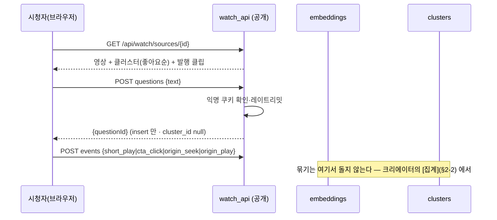
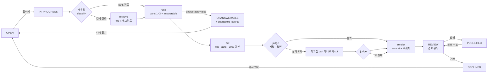

# TEASE 개발 실행 계획 — update_plan.md

**2026-09-05.** `tease.md` 가 *무엇을* 만들지라면, 이 문서는 *어떤 순서로, 어떤 단위로, 무엇을 확인하고
넘어가는지*다. 해커톤(원티드 AI 해커톤 2026, **D-day: ____ 채울 것**)까지 코드가 어디에 있어야 하는지를
마일스톤으로 자르고, 각 마일스톤에 **완료 조건(눈으로 확인)** 과 **지켜야 할 불변식(테스트)** 을 붙인다.

아티팩트 링크 : https://claude.ai/code/artifact/9a735021-812b-4a5d-8a6b-2ee37f469a49?via=auto_preview


| 알고 싶은 것 | 어디 |
|---|---|
| 제품·아키텍처·스키마 DDL·미결 사항 | [`tease.md`](tease.md) — 정본. 이 문서는 그것을 바꾸지 않는다 |
| 파이프라인 내부·규약 | [`make_shorts.md`](make_shorts.md) |
| 지금 상태·함정 | [`handoff.md`](handoff.md) |
| **개발 순서·완료 조건·상태 관리 방식** | **이 문서** |

표기: 🔴 치명 · **[결정]** 이 문서에서 정한 것 · **[tease 수정]** tease.md 에 반영해야 하는 어긋남

---

## 0. 원칙 — 얇게 관통하고, 상태는 한 곳에서

1. **얇게 관통 먼저.** 질문 등록 → 클러스터 → [답하기] → 단일 part 클립 → 발행 → `/watch` 재생까지
   **한 줄로 끝까지** 먼저 뚫는다(M1~M5a). 조합·judge·채널 검색은 그 위에 얹는다. make_shorts.md Phase A 가
   5분 조각으로 관통했던 것과 같은 이유다 — 끝까지 가 보기 전에는 무엇이 문제인지 모른다.
2. **상태 전이는 한 모듈에서만.** 클러스터 상태(§6-6)를 바꾸는 코드는 `tease/clusters.py` 의 `transition()`
   하나다. 허용된 간선 표가 코드에 있고, 표에 없는 전이는 예외다. 화면·API·잡 어디서도 `update … set status`
   를 직접 쓰지 않는다. **플로우가 복잡할수록 이 한 곳이 값을 한다.**
3. **잡 하나 = 고정 DAG 하나.** [답하기]는 `answer.run()` 한 함수가 라우팅→검색→rank→cut→judge→render 를
   순서대로 부른다. 에이전트가 다음 단계를 고르는 구조가 아니다(tease §5-7). 각 단계는 결과를 DB 에 쓰고
   `stage_calls` 에 남긴 뒤 다음으로 간다 — 중간에 죽어도 **어디까지 됐는지가 DB 에 있다.**
4. **인증 경계는 라우터 단위로.** 공개 라우터(`/api/watch/**`)와 스튜디오 라우터(`/api/**`)를 `APIRouter` 로
   나누고 `require_auth` 를 **라우터에** 건다. 엔드포인트마다 `Depends` 를 붙이는 지금 방식은 새 엔드포인트에서
   빠뜨리기 쉽다 — 라우터에 걸면 구조적으로 빠뜨릴 수 없다.
5. **마일스톤마다 handoff.md 를 갱신한다.** "지금 뭐가 있고 다음에 뭘 하나"가 항상 참이어야 한다.
6. **이름.** 패키지·레포·CLI 는 `shorts_maker`/`sm` 그대로 둔다. **TEASE** 는 제품 이름이라 화면 문자열과
   제출 문서에만 쓴다(`web/src/shared/brand.ts` 상수 하나). 해커톤 중에 레포를 개명하지 않는다.

---

## 1. 코드가 지금 어디 있나 — 계획의 출발점

`tease.md` 가 쓰인 뒤(9/3) 코드를 다시 읽고 확인한 것. 계획은 이 사실 위에 선다.

| 사실 | 계획에 미치는 영향 |
|---|---|
| `stt.py` 는 이미 `word_timestamps=True` 고 `utterances.words` 가 전 행 채워진다 | **[tease 수정]** §5-8 "켜기만 하면" 은 틀렸다 — 이미 켜져 있고, **cut 이 단어 경계를 쓰지 않는 것**이 남은 일이다(M8) |
| `stage_calls.stage` CHECK = `ping·chunk·stt·segment·describe·rank·cut·render` | v9 에서 재생성. 새 stage 는 tease §6-4 의 6개 + **`download`·`preview`** (지금 기록 안 되는 두 단계) |
| DB 는 비어 있다(9/4 리셋). 운영 서버에도 DB 가 없다 | v9 마이그레이션의 **위험이 0** 이다. 그래도 `MIGRATIONS[9]` 는 쓴다 — 새 DB 와 마이그레이션한 DB 의 `table_info` 일치 테스트가 앞으로의 안전망이다 |
| 화면 "다시 추출"은 청크를 **교체하지 않고 추가**한다. UI 는 `chunks[0]` 만 본다 | 두 청크가 생기면 rank 의 `[idx]` 가 충돌한다. **M0 에서 고친다** — 교체 semantics 로 |
| rank 가 `segments.excluded_by='auto'` 를 영구 기록한다. 읽는 곳 없음 | 중립 자산에 run 의 판정을 쓰는 것. **M0 에서 제거** — `runs.ranked.excluded` 에 이미 있다 |
| `sources.status` 는 아무도 RUNNING 으로 바꾸지 않는다 | M0 에서 download/register 잡이 채우게 한다(작은 일) |
| 유튜브 다운로드와 세그먼트 미리보기는 `stage_calls` 에 없다 | v9 stage 에 `download`·`preview` 추가하고 기록 |
| 미리보기 ffmpeg 가 잡 큐를 우회한다 | 스튜디오 전용이고 `-c copy` 라 가볍다. **그대로 둔다.** 문서에 "구조적 동시 1건" 의 예외로 적는다 |
| `api.py` 549줄에 인증·조회·잡·파일·SPA 가 한 파일 | M0 에서 라우터 분리. 공개 면을 붙이기 **전에** 해야 한다 |
| `web/` 은 라우터 없음, `ShortsPage` 664줄 | M4 에서 `shared/studio/watch` 재배치 + react-router |
| tease §5-1 자막 우선은 make_shorts §1-2 실측(자동자막 타임스탬프 겹침)과 충돌 | **[결정]** VTT 대신 **`json3` 포맷**을 받는다 — 단어 단위 `tOffsetMs` 가 있어 겹침 문제가 없고 단어 타임스탬프까지 얻는다(M7). tease §5-1 을 이렇게 고친다 |

---

## 2. 전체 그림 — 두 플로우와 상태

### 2-1. 시청자 플로우 (`/watch`, 무인증)



**공개 경로의 외부 호출은 0회다.** 전부 INSERT/SELECT 다. 묶기는 크리에이터가 트리거한다(D11).

### 2-2. 크리에이터 플로우 (`/studio`, 인증) — [집계] 잡, 그리고 [답하기] 잡

**[집계]** (`kind='aggregate'`, 스튜디오가 영상을 열 때 자동 1회 + 버튼):

```
미분류 질문(cluster_id null) + 기존 클러스터 대표 문장
  → LLM 1회  : 새 그룹의 대표 문장만 뽑는다              [stage=cluster]  검증: 비어 있지 않음 · 기존과 중복 아님
  → 임베딩 1회: 대표 문장 + 미분류 질문을 배치로          [stage=embed]
  → 코사인    : 질문마다 가장 가까운 대표, ≥ θ 면 합류, 아니면 단독 클러스터(대표=원문)
  → SQL       : "N명이 궁금해함" = count(questions) + sum(likes)
```

🔴 LLM 은 **이름만** 짓는다. 소속은 임베딩, 개수는 SQL. 증분이라 기존 클러스터 id·좋아요는 보존된다.

**[답하기]** (`kind='answer'`):



한 잡(`kind='answer'`)이 `B → V` 를 끝까지 간다. 잡이 죽으면 재기동 시 `IN_PROGRESS → OPEN` (지금의
`RUNNING → FAILED` 정리와 같은 자리).

### 2-3. 상태 전이 표 — `clusters.transition()` 이 강제한다

| from \ to | OPEN | IN_PROGRESS | REVIEW | PUBLISHED | DECLINED | UNANSWERABLE |
|---|---|---|---|---|---|---|
| OPEN | | 답하기 | | | | |
| IN_PROGRESS | 잡 실패·재기동 | | 파이프라인 완료 | | | rank answerable=false |
| REVIEW | 다시 열기 | 다시 답하기 | | 발행 | 거절 | |
| PUBLISHED | | | 발행 취소 | | | |
| DECLINED | 다시 열기 | | | | | |
| UNANSWERABLE | 다시 열기 | | | | | |

빈 칸은 예외다. `tests/test_clusters.py` 가 이 표를 **전부** 돈다(36칸).

### 2-4. 불변식 — 어기면 데모가 아니라 제품이 틀린 것

| # | 불변식 | 지키는 곳 | 테스트 |
|---|---|---|---|
| I1 | 미발행 클립 파일은 공개 경로에서 **404** | `watch_api.get_clip_file` | `test_watch_api.py` |
| I2 | `PUBLISHED` 클러스터 ↔ `published_at not null` 클립이 **정확히 1개** | `transition()` 이 발행 시 검사 | `test_clusters.py` |
| I3 | 같은 viewer 가 같은 질문에 좋아요 2회 불가 | `unique(question_id, viewer_id)` | `test_schema.py` |
| I4 | `clip_parts` 합 ≤ `SHORTS_TEASER_MAX_SEC` | `cutting.enforce_budget()` — LLM 이 말한 길이를 믿지 않는다 | `test_cutting.py` |
| I5 | part 의 발화 범위는 그 세그먼트 안, 초는 `utterances` 에서 | `ranking.parse_response` 화이트리스트 | `test_ranking.py` |
| I6 | 임베딩은 `(kind, ref_id, model)` 유니크 — 모델 바꾸면 섞이지 않음 | 스키마 | `test_schema.py` |
| I7 | 공개 쓰기 API 는 레이트리밋을 넘으면 **429** | `watch_api` 미들웨어 | `test_watch_api.py` |
| I8 | 모든 새 stage 가 `stage_calls` 에 남는다 | 각 단계 | `test_answer.py` (mock Gemini 로 DAG 1회 돌려 행 수 확인) |
| I9 | 스튜디오 라우터의 **모든** 경로가 401 without cookie | 라우터 레벨 `require_auth` | `test_api_auth.py` — 라우트 테이블을 순회해 전부 친다 |
| I10 | 새 DB 와 v8→v9 마이그레이션 DB 의 `table_info` 가 같다 | `store.MIGRATIONS[9]` | `test_schema.py` |
| I11 | 공개 API 는 어떤 경로에서도 Gemini(임베딩 포함)를 부르지 않는다 | `watch_api` | `test_watch_api.py` — gemini mock 호출 수 0 |
| I12 | 재집계 후에도 `questions.text`·기존 `cluster_id`·좋아요가 그대로 | `clusters.aggregate` 증분 | `test_clusters.py` |

---

## 3. 코드 배치 — 파이프라인 본체와 TEASE 를 패키지로 가른다

```
backend/src/shorts_maker/
  (기존 flat 모듈: ingest · stt · segmentation · ranking · cutting · render · …)   ← 파이프라인 본체. 손대되 옮기지 않는다
  api.py            앱 생성 · /auth/** · /health · SPA catch-all · 라우터 include (얇아진다)
  studio_api.py     기존 /api/** 엔드포인트 이동. APIRouter(dependencies=[require_auth])
  tease/
    __init__.py
    schema_v9.py    _recreate_stage_calls 등 MIGRATIONS[9] 의 함수 스텝
    embeddings.py   embed_texts() · store/load(kind, ref_id) · cosine_topk()          [stage=embed]
    clusters.py     attach_question() · rewrite_canonical() · transition() · 상태표     [stage=cluster]
    routing.py      classify(canonical) -> 'retrieval' | 'rank'                        [stage=classify]
    retrieval.py    candidates(cluster) -> 세그먼트 top-k (이 영상 → 같은 channel)     [stage=retrieve]
    judge.py        judge(parts_text, question) -> {standalone, answers, reason}       [stage=judge]
    answer.py       run(cluster_id) — 고정 DAG. 위 모듈들을 순서대로 부른다
    events.py       viewer_events 적재 · 퍼널 집계(insights)
    viewers.py      익명 쿠키 발급·확인 · 레이트리밋(메모리)
    watch_api.py    APIRouter — /api/watch/** (인증 없음)
    studio_ext.py   APIRouter — 클러스터·발행·insights (인증)
backend/eval/
    questions.yaml  §10-3 질문 세트 (유형·기대·붙어야 할 클러스터)
web/src/
  shared/   client · types · hooks · brand.ts · 공통 CSS
  studio/   기존 ShortsPage → SourcePage + ClusterPanel + InsightsPage
  watch/    HomePage · WatchPage(iframe · QuestionPanel · ShortsRow · CTA)
  App.tsx   react-router, React.lazy 로 두 트리 분리
```

**왜 서브패키지인가.** tease §0 의 문장 그대로다 — "파이프라인 본체는 그대로 쓰고, 앞과 뒤를 붙인다."
경계가 디렉터리로 보이면 "이건 중립 자산 파이프라인인가, 제품 로직인가"를 매번 묻지 않아도 된다.
`ranking.py`·`cutting.py`·`render.py` 는 **확장**하되(parts·budget·concat) 그 자리에 둔다.

---

## 4. 마일스톤

크기: S(반나절) · M(하루) · L(이틀). 혼자면 순서대로, 둘이면 §5 의 병렬 트랙.
**컷 라인**: M0~M6 이 데모(§10-2 시나리오 1~8)의 필수다. M7·M8 은 있으면 좋은 것. M9 는 반드시.

### M0 — 정리와 결정 (S) 🔴 먼저 — **완료 2026-09-06**

**목적**: 뒤의 마일스톤이 깨진 바닥 위에 서지 않게 한다.

- [x] tease.md §13 미결 9개에 **[결정]** 기록. 권고대로 — 표의 "권고" 열이 "결정" 이 됐다.
      추가 결정 4개는 §6 참조
- [x] `api.py` → `api.py`(앱 조립·공개 라우트) + `studio_api.py`(APIRouter `/api`, 라우터 레벨 `require_auth`)
      + `deps.py`(cfg·queue·require_auth — 두 모듈이 공유하는 것. 순환 import 를 피하려고 뺐다). 동작 변화 0.
      `test_api_auth.py` 에 **라우트 테이블 순회 테스트** — 스튜디오 라우터의 모든 라우트×메서드가 401,
      앱의 모든 `/api/**` 는 스튜디오 라우터 소속, 공개 라우트는 정확히 6개(`/auth/*` 3 · `/health` · `/debug` · catch-all)
- [x] "다시 추출" → **교체**. `ingest.add_chunk(replace=True)` 가 기존 청크(+cascade: 발화·구간·클립)와
      **그 소스의 run** 을 지우고 같은 idx 로 만든다. run 은 chunks 에 매달려 있지 않아 따로 지운다 — 남기면
      `runs.ranked` 가 사라진 구간 idx 를 가리킨다. 추출을 먼저 하고 지운다(실패하면 옛 전사가 남는다).
      화면 버튼·`sm chunk add --replace` 가 넘긴다. replace 없이 두 번째 청크는 API 409 · CLI IngestError
- [x] `ranking.run_for_source` 의 `update segments set excluded_by='auto'` 제거. 제외 목록은 `runs.ranked` 에만.
      컬럼은 'human' 용도로 남긴다(스키마 변경은 M1)
- [x] `download`·`register` 잡이 `sources.status` 를 RUNNING→DONE/FAILED 로. `ingest.begin_source`(행을
      `pending:` 지문으로 먼저) → `finish_source`(길이·sha256·DONE). 실패는 FAILED+error 로 남고, 같은 경로
      재시도는 **같은 id** 를 다시 쓴다. 같은 내용을 다른 파일명으로 넣으면 행을 지우고 거절(유령 행 방지).
      `download.fetch` 를 `probe`/`target_path`/`fetch_video` 로 갈라 다운로드 전에 경로를 안다
- [x] `web/src/shared/brand.ts`: `PRODUCT_NAME = "TEASE"`, `REPO_NAME = "shorts_maker"`. 제목 2곳 + index.html
- [x] `numpy` 의존성 추가(임베딩 코사인). 근거: `frombuffer` + 행렬곱 한 줄 — 순수 파이썬 루프는 세그먼트 수백 ×
      질문 수백에서 이미 수십 ms 다

**완료 조건**: 테스트 전부 통과(151) · 화면에서 기존 파이프라인 5단계가 그대로 돈다 · `git log` 에 M0 커밋

### M1 — 스키마 v9 (M)

tease §6 DDL 그대로. 여기서 정하는 것만 적는다.

- [ ] `store.MIGRATIONS: dict[int, list[str | Callable[[sqlite3.Connection], None]]]`. `_apply_once` 가 callable 을 그냥 부른다
- [ ] `tease/schema_v9.py::recreate_stage_calls(conn)` — `stage_calls_new` 존재 여부를 보고 이어서 하거나 정리(멱등).
      새 CHECK: 기존 8개 + `caption·embed·retrieve·cluster·judge·classify` + **`download·preview`**
- [ ] `schema.sql` 헤더의 "v1" 을 지우고 v9 로. `SCHEMA_VERSION = 9`
- [ ] 테스트: 새 DB vs v8→v9 마이그레이션 DB 의 전 테이블 `pragma table_info` 일치(I10) · `clip_parts` 백필 ·
      `stage_calls` 새 stage 삽입 성공 · 옛 stage 도 여전히 성공
- [ ] `sm db status` 가 새 테이블 6개를 센다(`store.TABLES` 갱신)

**완료 조건**: `docker compose exec shorts sm db status` 가 v9 · 15 테이블. 테스트 통과.
**tease 수정**: 없음(DDL 그대로). §6-4 stage 목록에 `download·preview` 두 줄 추가.

### M2 — 임베딩·클러스터 (M~L)

- [ ] `embeddings.embed_texts(cfg, texts, task_type)` — `gemini-embedding-001`, 배치 호출, `stage_calls(stage='embed')`.
      벡터는 float32 LE blob. `dim` 저장
- [ ] `embeddings.index_segments(conn, cfg, source_id)` — 세그먼트 `description` (+발화 앞 200자) 를
      `RETRIEVAL_DOCUMENT` 로. **세그먼트가 만들어지는 순간(segmentation 직후) 자동으로 부른다** — 검색 시점에
      임베딩이 없으면 그때 만드는 폴백도 둔다
- [ ] `clusters.aggregate(conn, cfg, source_id)` — **[집계] 잡.** ① `cluster_id is null` 질문 + 기존 대표 문장 →
      LLM 1회로 **새 그룹 대표 문장만** `[stage=cluster]` (검증: 비어 있지 않음 · 기존과 중복 아님)
      ② 대표 문장 + 미분류 질문 배치 임베딩 `[stage=embed]` ③ 질문마다 최근접 대표, 코사인 ≥ θ 면 합류,
      아니면 단독 클러스터(대표=원문). θ 는 `SHORTS_CLUSTER_THETA`(기본 0.85)
- [ ] 🔴 LLM 에게 소속·개수를 시키지 않는다. 개수는 SQL 뷰(`cluster_demand`: count + likes). 재집계해도
      `questions.text` 와 기존 `cluster_id`·좋아요는 그대로(증분)
- [ ] 대표 문장이 새 질문 유입으로 어색해지면 크리에이터가 `PATCH` 로 고친다 — 자동 재작성은 하지 않는다
      (고치면 임베딩을 다시 계산한다)
- [ ] `clusters.transition()` + 상태표 + 36칸 테스트
- [ ] **평가 CLI** `sm tease eval-cluster --source 1 [--theta 0.85]` — `backend/eval/questions.yaml` 을 전부 insert
      한 뒤 `aggregate()` 를 돌리고 "붙어야 할 것이 붙고 붙지 말아야 할 것이 안 붙었나" 를 표로.
      🔴 LLM 1회 + 임베딩이 실제로 나간다(센트 미만). θ 를 0.80~0.90 돌려 **표를 tease §13 에 붙인다**

**완료 조건**: eval 표에서 "급여 수준이 어떤가요?" 가 "희망연봉…" 에 붙고 "야근 많아요?" 가 안 붙는 θ 가 존재한다.
그 값이 기본값이 된다.
**리스크**: 한국어 짧은 질문의 임베딩 유사도 분포가 좁을 수 있다 → 그러면 θ 하나로 안 갈리고 **LLM 확인 1회**를
경계 구간(θ±0.03)에만 넣는다. 결정은 eval 표를 보고.

### M3 — 공개 API + 익명 시청자 + 레이트리밋 (M)

- [ ] `viewers.py`: `tease_viewer` 쿠키(UUID4 · httpOnly · SameSite=lax · 1년). `/api/watch/**` 와 `/watch*`
      응답에 없으면 발급. 레이트리밋: viewer 당 질문 5/분 · 좋아요 30/분, IP 당 ×3. 메모리 카운터
      (`auth.py` 잠금과 같은 방식). 넘으면 429
- [ ] `watch_api.py` — tease §7-1 의 6개. **인증 의존성 없음.** 읽기는 전부 `published` 조건.
      🔴 질문 등록은 **insert 만** — 임베딩도 LLM 도 부르지 않는다(D11). 테스트: Gemini mock 이 한 번도 안 불린다
- [ ] 🔴 `GET /api/watch/clips/{id}/file` — `published_at is not null` 아니면 **404**. 기존 `/api/clips/{id}/file` 은
      스튜디오 라우터에 그대로(프리뷰용)
- [ ] `events.record()` — kind 검증은 스키마 CHECK 가 한다. payload 는 JSON 문자열 그대로
- [ ] 테스트 `test_watch_api.py`: I1 · I3 · I7 · 미발행 영상은 목록에 없음 · 질문 200자 상한 · 쿠키 발급

**완료 조건**: 비밀번호 모드 컨테이너에서 `curl` 로 질문 등록·좋아요·이벤트가 쿠키만으로 되고, 미발행 클립이 404.
`GEMINI_API_KEY` 를 비운 채로도 공개 API 전부가 동작한다(외부 호출 0회의 증명).

### M4 — `web/` 재배치 + `/watch` 화면 (L)

M1 이 끝나면 M2·M3 과 **병렬 가능**(타입만 먼저 맞추면 API 는 mock 으로).

- [ ] `react-router` 추가. `App.tsx` = 라우터 + `React.lazy(studio)` / `React.lazy(watch)`. 인증 게이트는 `/studio/**` 에만
- [ ] `shared/`: `client.ts`·`types.ts`·`useAsync`·CSS·`brand.ts`. `types.ts` 에 v9 타입 추가(클러스터·질문·이벤트)
- [ ] `studio/`: 기존 `ShortsPage` 를 `SourcePage` 로 이동(동작 변화 0). `/studio` 는 영상 목록
- [ ] `watch/HomePage`: 발행 영상 카드. `watch/WatchPage`: 유튜브 IFrame Player API(`youtube-nocookie.com`) + 질문 패널
      (좋아요순 · 입력 · "N명이 궁금해함") + 숏폼 줄(`<video>`, 공개 클립 URL) + 숏폼 끝 CTA → `player.seekTo()`
- [ ] 계측: `short_play`(재생 시작) · `short_complete`(ended) · `cta_click` · `origin_seek`(seekTo 직후) ·
      `origin_play`(IFrame `onStateChange === PLAYING`, 클립 CTA 후 30초 안) · `question_post` · `like`
- [ ] 🔴 `useAsync` 의 "로딩 중 data=null 깜빡임" 은 `/watch` 에서 눈에 띈다 — 이전 data 를 유지하는 옵션 추가

**완료 조건**: `/watch/1` 에서 질문을 적으면 패널에 즉시 나타나고, 발행 클립을 틀고 CTA 를 누르면 같은 페이지의
유튜브 플레이어가 그 초로 이동한다. 이벤트 7종이 `viewer_events` 에 쌓인다.
**리스크**: 원티드 영상 임베드 차단 → 허락 때 확인. 안 되면 `<video>` 로 원본 직접 서빙(파일은 있다).

### M5 — [답하기] 파이프라인

#### M5a — 라우팅 + 검색 + 단일 part 관통 (M) 🔴 컷 라인 안쪽의 핵심

- [ ] `routing.classify()` — LLM 1회(수십 토큰) `[stage=classify]` → `runs.route`. 결과 스키마 강제
- [ ] `retrieval.candidates()` — 클러스터 임베딩 vs 세그먼트 임베딩 코사인, top-k(=5), **같은 `channel`** 의 다른
      영상까지. 최대 유사도 < `SHORTS_RETRIEVAL_MIN_SIM`(초기 0.5) 이면 답변 불가 1차 신호 `[stage=retrieve]`
- [ ] `ranking` 확장: 출력 `{answerable, reason, parts:[{segment_idx, start_utterance_idx, end_utterance_idx}]}`.
      **이번 단계에서는 parts 를 1개로 제한**해서 관통한다(프롬프트에 "하나만"). 기존 `rank` 경로(전 세그먼트,
      기준 프롬프트)는 그대로 살아 있어야 한다 — `POST /api/sources/{id}/rank` 회귀 테스트
- [ ] `cutting`: `clip_parts` 행 생성(part 1개). `clips.total_sec`. `enforce_budget()` (I4)
- [ ] `answer.run(cluster_id)`: transition(IN_PROGRESS) → classify → retrieve/skip → rank → cut → render →
      transition(REVIEW). 실패 시 transition(OPEN) + 에러를 클러스터에 표시(컬럼 `last_error` 는 v9 에 없다 —
      `runs.error` 를 보여준다)
- [ ] `studio_ext.py`: `POST /api/sources/{id}/aggregate`(잡, M2 의 aggregate) · `GET /api/sources/{id}/clusters` ·
      `POST /api/clusters/{id}/answer`(잡) ·
      `POST /api/clips/{id}/publish|unpublish` · `PATCH /api/clusters/{id}`
- [ ] 테스트: `test_answer.py` — Gemini 를 mock 으로 갈아 DAG 를 1회 돌리고 `stage_calls` 에 `classify·retrieve·rank·cut·render`
      가 순서대로 있는지(I8), 실패 주입 시 OPEN 으로 돌아오는지

**완료 조건**: `/watch` 에서 적은 질문이 `/studio` 에 보이고 [답하기] → 수십 초 → [발행] → `/watch` 에 숏폼이 붙는다.
**루프가 처음 닫히는 지점이다.** 여기서 데모 리허설 1회를 해 본다.

#### M5b — 조합 cut + 브릿지 + judge (L)

- [ ] `ranking` parts 1~3 허용. 프롬프트에 30초 예산 명시. 검증은 part 마다(I5)
- [ ] `cutting.enforce_budget()`: 합이 넘으면 점수 낮은 part 부터 자르고, 그래도 넘으면 최고점 하나
- [ ] `render`: part 별 `-ss/-t` 입력 → `concat` 필터. 사이에 **브릿지 카드 0.4초** — `color=black` 소스 위에
      "…41분에서 이어집니다" 를 **ASS 로** 얹는다(libass 는 확실히 있다. `drawtext` 는 데비안 빌드에 있는지
      `sm doctor` 로 확인 후 선택). 자막 큐는 part 별 상대 초 → 이어붙인 타임라인으로 오프셋
- [ ] `judge.judge()` — 조합된 발화 텍스트 순서대로 + 질문 → `{standalone, answers, reason}` `[stage=judge]`.
      결과 `clip_reviews(reviewer='llm', verdict=OK|NG, note=reason)`
- [ ] `answer.run()`: judge 실패 → 최고점 part 하나로 재cut·재judge **1회** → 또 실패면 REVIEW + 경고 플래그
      (경고는 `clip_reviews` 의 llm NG 로 표현 — 컬럼 추가 없음)
- [ ] 테스트: budget 강제 경계값 · 3 part concat 의 자막 오프셋 · judge 파싱 · bounded retry 가 정확히 1회

**완료 조건**: "지금 이직해야 하는 상태인지" 류 질문에서 2 part 클립이 나오고, 재생하면 브릿지 카드가 읽히고,
judge 소견이 스튜디오에 보인다. **사람이 보고 O/X 를 기록**한다(llm vs human 일치율의 첫 데이터).

#### M5c — 답변 불가 + 채널 검색 안내 (S)

- [ ] `answerable=false` → transition(UNANSWERABLE). `retrieval` 이 다른 영상에서 후보를 찾았으면 `suggested_source_id`
- [ ] `/watch` 질문 패널에 "이 영상엔 없어요 · ep.N 에서 다룹니다" 표시(발행된 영상일 때만 링크)
- [ ] 테스트: rank mock 이 `answerable=false` 를 주면 UNANSWERABLE + suggested 세팅

**완료 조건**: 두 영상이 등록된 상태에서 "면접 준비는요?" 가 다른 편을 가리킨다. 🔴 영상이 하나면 이 장면은 없다.

### M6 — 스튜디오 확장 + insights (L)

- [ ] `/studio/sources/:id` 를 열면 미분류 질문이 있을 때 **[집계]를 자동 1회** 제출(잡). 버튼으로도. 미분류 개수 표시
- [ ] `/studio` 영상 목록에 클러스터 수·OPEN 수·미분류 수. `/studio/sources/:id` 에 **수요 보드**(클러스터 랭킹 =
      좋아요 + 묶인 질문 수 · 상태별 · 묶인 질문 펼침 · 대표 문장 수정 · [답하기]/[거절]/[다시 열기])
- [ ] 클립 카드: parts 표시("12:30 → 41:00") · judge 소견 · [발행]/[발행 취소] · O/X
- [ ] `GET /api/clusters/{id}/trace` — 그 클러스터 run 의 `stage_calls` 순서대로 + 비용. 화면에 "이 질문에 든 비용 N원"
      **데모 8번 장면의 근거**이고 디버깅 창이기도 하다
- [ ] `GET /api/sources/{id}/insights` — 퍼널 5단계 카운트, 클러스터별. `events.funnel()`
- [ ] `/studio/insights` 화면: 퍼널 막대 + 클러스터 표. 3초 폴링(데모에서 실시간으로 보이게)
- [ ] `PATCH /api/clips/{id}/parts` (in/out 미세 조정 → 재렌더 잡) — **시간 남으면.** 데모에는 없어도 된다

**완료 조건**: §10-2 시나리오 1~8 을 **한 번에 끝까지** 리허설할 수 있다.

### M7 — 자막 우선 + 챕터 씨앗 (M) — 허락 후, 컷 라인 밖

- [ ] `yt-dlp --write-auto-sub --sub-lang ko --sub-format json3` → 파서 → `utterances`(단어 단위 `tOffsetMs` 로
      `words` 까지 채움) `[stage=caption]`. `sources.caption_source='youtube'`
- [ ] 없거나 파싱 실패 → whisper 폴백(지금 경로)
- [ ] `sources.chapters` 저장 → 분할 프롬프트 힌트. **측정**: 분할 경계 vs 챕터 경계 일치율을 `stage_calls.params` 에
- [ ] 테스트: json3 파서(겹침 없음 · 절대 초 · 빈 큐 제거) · 폴백 분기

**tease 수정**: §5-1 의 "VTT 파싱, 자막 큐 = 발화" → "json3, 단어 단위". make_shorts §1-2 실측과의 충돌이 해소된다.

### M8 — 단어 경계 cut + 캐싱 측정 (S) — 컷 라인 밖

- [ ] `cutting`: part 의 시작·끝을 발화 경계가 아니라 **첫·끝 단어 경계**로. 필러("음", "그러니까") 는 앞뒤 단어가
      필러 목록이면 뗀다. `clip_parts.start_sec/end_sec` 가 여기서 나온다
- [ ] 컨텍스트 캐싱: **rank 경로(전 세그먼트)에만** 시도. `stage_calls.cached_tokens` 전후 비교 표 → 이득 없으면 끈다.
      검색 경로는 프롬프트가 작아 대상이 아니다(tease §5-8 ⚠️)

### M9 — 데모 리허설 + 제출 (M) 🔴 반드시

- [ ] `sm tease seed --source N` — `eval/questions.yaml` 의 질문을 좋아요 수와 함께 미리 등록. 시나리오 4·6 이외는 **미리 발행**
- [ ] 두 영상(ep.45 + 면접 편, 또는 허락 전이면 니체 강연 2편) 등록·STT·분할·임베딩 완료 상태의 **볼륨 백업**
      (`docker compose exec shorts cp /data/shorts.db /data/shorts.db.demo`)
- [ ] 시나리오 1~8 을 시간 재며 3회. 라이브 구간(4·6)의 소요 시간 기록
- [ ] Gemini 장애 시 시나리오(1·3·5·7 만) 리허설 1회
- [ ] 제출 문서: tease §11 의 세 절을 채우고, §5-9 "하지 않는 것" 을 그대로 싣는다. 용어는 "retrieval-augmented selection",
      "bounded judge-retry loop" — 에이전트 하네스라고 쓰지 않는다
- [ ] handoff.md 를 "데모 상태" 기준으로 갱신

---

## 5. 두 명일 때의 병렬 트랙

```
       M0 ──► M1 ──┬──► M2 ──► M5a ──► M5b ──► M5c ──► M6(백엔드) ──► M9
                   │                                       ▲
                   └──► M3 ──► M4 ─────────────────────────┘  (M6 화면)
```

- **A(백엔드)**: M0 → M1 → M2 → M5a → M5b → M5c → M6 API → M7/M8
- **B(웹)**: M0 의 brand · M4 (M1 의 타입이 나오는 대로) → M3 와 맞물려 `/watch` → M6 화면
- 만나는 지점: **M5a 완료 = 루프가 닫힘.** 여기서 첫 통합 리허설.
- 혼자면 위 그림을 왼쪽에서 오른쪽으로. M4 는 M3 직후.

---

## 6. 결정 — tease §13 에 더해 이 문서가 정하는 것

| # | 결정 | 근거 |
|---|---|---|
| D1 | tease §13 의 9개는 **권고대로** 간다 | 각 권고에 근거가 달려 있고, 반대할 새 정보가 없다. M0 에서 표에 날짜를 적는다 |
| D2 | 자막은 VTT 가 아니라 **json3** | 자동자막 VTT 는 롤링 윈도로 타임스탬프가 겹쳐 쓸 수 없다(make_shorts §1-2 실측). json3 은 단어 단위 오프셋이라 겹침이 없고 단어 타임스탬프까지 준다 |
| D3 | `numpy` 도입 | 코사인 top-k 를 행렬곱 한 줄로. 순수 파이썬은 질문×세그먼트 곱에서 이미 느리다. 벡터 DB 는 여전히 안 쓴다 |
| D4 | 브릿지 카드는 **ASS** 로 | libass 는 이미 필수 의존이고 `sm doctor` 가 확인한다. `drawtext` 는 빌드마다 유무가 갈린다 |
| D5 | Postgres(C5)는 **해커톤 뒤** | SQLite + 볼륨으로 데모 규모(수백 행)에 부족한 게 없다. 전환은 전 SQL 을 건드리는 일이라 지금 하면 다른 모든 것이 밀린다 |
| D6 | 라우터 분리 + 라우터 레벨 인증(M0) | 공개 면을 붙이기 전에 경계를 구조로 만든다. 엔드포인트마다 `Depends` 는 빠뜨리기 쉽다 |
| D7 | 클러스터 상태 변경은 `transition()` 만 | 플로우 관리의 핵심. §2-3 표가 코드와 테스트에 그대로 있다 |
| D8 | 새 stage 에 `download`·`preview` 포함 | "모든 단계는 stage_calls" 규약의 구멍 둘을 v9 재생성에 얹어 한 번에 막는다 |
| D9 | 레포·패키지 이름 유지, TEASE 는 화면·문서 | 해커톤 중 개명은 위험만 있고 이득이 없다 |
| D10 | `/watch` 의 `origin_play` 는 CTA 후 30초 창 안의 PLAYING 만 | 시청자가 원래 보던 재생을 유입으로 세면 지표가 거짓이 된다 |
| D11 | 질문 묶기는 **크리에이터가 트리거하는 [집계]** 로. 질문 등록 시엔 insert 만 | 공개 경로에서 요청마다 외부 API 를 부르면 공격면이다. 제품 정의상 취합은 크리에이터의 행동. LLM 은 대표 문장만, 소속은 임베딩, 개수는 SQL — LLM 에게 인덱스·개수를 시키면 틀린다 (2026-09-05) |

---

## 7. 리스크와 대비

| 리스크 | 신호 | 대비 |
|---|---|---|
| 원티드 허락이 늦다 | M6 시작 시점에 답 없음 | 니체 강연 2편으로 데모를 만든다. 스키마·로직은 영상이 뭐든 같다. 질문 세트만 강연용으로 하나 더(`eval/questions_nietzsche.yaml`) |
| 임베딩 유사도로 θ 가 안 갈린다 | M2 eval 표에서 "급여 수준" 과 "야근" 의 유사도가 겹친다 | 경계 구간에만 LLM 확인 1회. 결정은 표를 보고 |
| judge 가 좋은 조합을 거부 | M5b 리허설에서 사람 OK · llm NG 가 잦다 | 실패해도 REVIEW 로 올라간다. 프롬프트를 고치되 **일치율 데이터를 남긴다** |
| 잘못 이어붙인 클립이 협박 편지처럼 들린다 | M5b 첫 결과물 | judge 없이는 조합을 발행하지 않는다(tease §5-6). 단일 part 로 후퇴하는 경로가 항상 있다 |
| 라이브 데모에서 Gemini 장애·지연 | 리허설 중 재시도 로그 | 시나리오 4·6 외 전부 미리 발행. 발행된 것은 AI 없이 돈다 |
| 2vCPU 에서 STT·렌더가 데모 중 겹친다 | 워커 큐 대기 | 데모에서 한 번에 하나만 누른다. 큐 위치를 화면에 표시(M6) |
| 유튜브 임베드 차단 | 허락 때 확인 | `<video>` 로 원본 직접 서빙. 파일은 이미 있다 |
| 범위가 넘친다 | M5a 가 D-7 에 안 끝남 | **M5b·M5c·M6 insights 를 자른다.** 단일 part 루프 + 질문 묶기 + 발행만으로도 "수요를 먼저 받고 만든다"는 성립한다 |

---

## 8. 각 마일스톤을 끝낼 때

1. 테스트 통과 (`uv run python -m unittest discover -s tests -t .`) · `npm run build && npm run lint`
2. `docker compose up -d --build` 로 **컨테이너에서** 완료 조건을 눈으로 확인
3. `stage_calls` 에 그 마일스톤의 새 stage 가 실제로 쌓였는지 `sm db status` 와 SQL 로 확인
4. handoff.md §1·§5·§7 갱신. tease.md 와 어긋난 게 생겼으면 **tease.md 를 먼저** 고친다
5. 커밋은 사용자 요청 시(CLAUDE.md). 마일스톤 단위로 나눠 달라고 요청하는 것을 권한다 — `git log` 가 곧 진행표다

---

## 부록 A — `backend/eval/questions.yaml` 형식

```yaml
source: 1                     # ep.45 (또는 니체 강연)
theta_expect: 0.85
questions:
  - text: 희망연봉 얼마나 올려 불러요?
    type: fact
    expect: { parts: 1, route: retrieval }
  - text: 급여 수준이 어떤가요?
    type: merge
    expect: { merges_into: 희망연봉 얼마나 올려 불러요? }
  - text: 야근 많아요?
    type: merge_reject
    expect: { merges_into: null }
  - text: 지금 이직해야 하는 상태인지 어떻게 알아요?
    type: self_diagnosis
    expect: { parts: 2, judge: pass }
  - text: 면접 준비는요?
    type: out_of_series
    expect: { status: UNANSWERABLE, suggested: true }
  - text: 핵심만 30초로
    type: highlight
    expect: { route: rank }
```

`sm tease eval-cluster` 는 `merge*` 항목만, `sm tease eval-answer`(M5 이후) 는 나머지를 실제로 돌려 표로 낸다.
🔴 둘 다 Gemini 를 부른다 — 비용은 센트 단위지만 단위 테스트가 아니다. `tests/` 에 넣지 않는다.

## 부록 B — 설정 키 (전부 `config.DEFAULTS` 에, compose 에는 넣지 않는다 — 컨테이너/호스트 공통 값)

| 키 | 기본 | 쓰는 곳 |
|---|---|---|
| `SHORTS_EMBED_MODEL` | `gemini-embedding-001` | embeddings |
| `SHORTS_CLUSTER_THETA` | `0.85` | clusters.attach_question |
| `SHORTS_RETRIEVAL_K` | `5` | retrieval |
| `SHORTS_RETRIEVAL_MIN_SIM` | `0.5` | retrieval → 답변 불가 1차 신호 |
| `SHORTS_TEASER_MAX_SEC` | `30` | cutting.enforce_budget |
| `SHORTS_BRIDGE_SEC` | `0.4` | render |
| `SHORTS_RATE_QUESTIONS_PER_MIN` | `5` | viewers |
| `SHORTS_RATE_LIKES_PER_MIN` | `30` | viewers |
