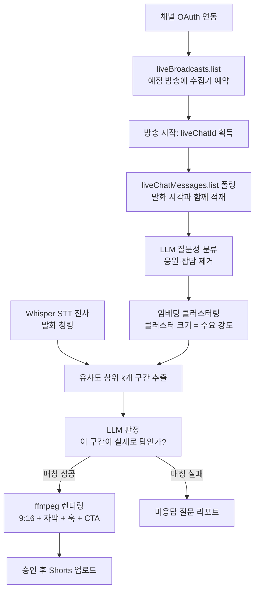

<aside>
🎯

**한 줄 정의** — **바이럴할 구간이 아니라 결정 구간을 찾는다.** 조회수를 만드는 30초가 아니라, 지원 버튼을 누르게 하는 20초를 자르는 웹 서비스.

라이브 설명회에서 지원·신청 결정에 필요한 정보가 구체적으로 답해진 구간을 찾아 **"질문 → 답변" 숏폼**으로 만들고, 끝까지 답하지 않은 것을 리포트로 돌려준다.

**듣는 쪽은 무료, 여는 쪽만 유료.** 듣는 쪽은 고객이 아니라 질문 데이터를 만드는 원료다.

</aside>

**Category**

Conversion Clipping

**Target**

전환 목적 기업 채널

**Core Format**

라이브 설명회

**Model**

듣는 쪽 무료 · 여는 쪽 유료

**First Customer**

원티드 · 기업 채용팀

---

## 01 · 한 장 요약

### 유튜브에는 두 종류가 있고, 클리핑 도구는 한쪽만 위해 만들어졌다

- **타깃.** 조회수·협찬이 목적인 채널(크리에이터)이 아니라, 채널 밖의 행동 — 지원서 제출, 원서 접수, 상담 예약, 트라이얼 신청 — 을 목적으로 유튜브를 운영하는 기업. 이들에게 유튜브는 미디어가 아니라 **영업 채널**이다.
- **문제.** 이런 콘텐츠는 구조적으로 재미가 없다. 재미가 목적이 아니라 정보 전달이 목적이니까. 그래서 90분 설명회의 완주율은 바닥이고, 지원 결정에 필요한 답은 영상 안에 있는데 도달하지 않는다.
- **구매 동기는 편의가 아니라 경쟁이다.** 지원자 한 명이 한 시즌에 마주하는 설명회는 수십 개이고, 전부 90분이다. 다 볼 수 없으니 요약본이 있는 설명회만 소비된다. "귀찮아서 안 만든다"가 아니라 "안 만들면 우리만 안 보인다"가 되는 순간, 이 지출은 미룰 수 없는 것이 된다.
- **왜 기존 도구가 안 맞는가.** Opus Clip류는 "바이럴할 것 같은 곳"을 자른다. 그런데 전환 목적 채널에게 바이럴은 **잘못된 목표**다. 조회수 10만짜리 클립보다, 마감일과 자격요건이 담긴 조회수 2천짜리 클립이 낫다. 신호원이 아니라 **목적함수 자체가 다르다.**
- **고유 기술은 신호원이 아니라 추출 기준이다.** 신호원(채팅)을 정체성으로 삼으면 신호가 얇을 때 제품이 사라진다. 우리가 파는 것은 **결정·행동·신뢰 정보를 가려내는 기준**이고, 채팅은 그걸 돕는 다섯 신호 중 하나다(§03).
- **그럼에도 라이브 설명회에 1차 집중한다.** 라이브 채팅은 **발화 시각과 자동으로 동기화된 질문 로그**이고, 자동 수집이 가능한 유일한 경로이며, 사전 연동이라는 해자가 여기서만 성립한다.
- **구조적 해자.** 종료된 라이브의 채팅은 공식 API로 회수할 수 없다(§06). 즉 방송 전에 연동된 서비스만 이 데이터를 가질 수 있다. 나중에 진입한 경쟁자는 과거 데이터를 영원히 얻지 못한다.
- **수익 모델.** 설명회를 *주기적으로* 여는 조직 대상 B2B 구독 — 채용팀, 대학 입학처, SaaS 마케팅팀, 금융사, 공공기관(§07). **듣는 쪽은 끝까지 무료다.** 그들은 고객이 아니라 원료이고, 과금하는 순간 데이터가 마른다.

## 02 · 시장 정의

### 재미없어야만 하는 콘텐츠를 만드는 사람들

유튜브를 성과 지표로 나누면 두 개의 완전히 다른 시장이 나온다. 지금까지 클리핑 도구는 전부 A형만 보고 만들어졌다.

| 구분 | A형 · 조회수 채널 | B형 · 전환 채널 ← CLIPQ |
| --- | --- | --- |
| 운영 주체 | 크리에이터, 엔터, 미디어 | 기업 채용팀, 대학 입학처, SaaS 마케팅, 금융, 공공 |
| 성과 지표 | 조회수, 구독자, 광고·협찬 단가 | 지원서 제출, 원서 접수, 상담 예약, 트라이얼 |
| 대표 포맷 | 기획 영상, 브이로그, 예능 | 라이브 설명회, 웨비나, 직무 인터뷰, Q&A |
| 콘텐츠 성격 | 재미가 목적 | 정보 전달이 목적 — 재미없는 것이 당연하다 |
| 길이 | 10~20분 | 60~120분 |
| 클리핑 기준 | 바이럴 가능성 | 전환에 필요한 정보 — *아직 아무도 안 만듦* |
| 예산 출처 | 수익의 재투자 | 이미 집행 중인 채용·마케팅·홍보 예산 |

<aside>
⚡

**B형 시장의 진짜 압력** — 지원자 한 명이 한 시즌에 지원하는 기업은 수십 곳이고, 각 기업이 90분 설명회를 올린다. 총 재생시간이 수십 시간이다. 물리적으로 다 볼 수 없으니, 요약본이 있는 설명회만 소비되고 나머지는 존재하지 않는 것과 같아진다. 즉 이건 담당자의 편의 문제가 아니라 **"안 만들면 우리 설명회만 안 보인다"는 경쟁 문제**다. 편의를 파는 제품은 다음 분기로 밀리지만, 경쟁 압력은 밀리지 않는다.

</aside>

### B형 채널의 두 가지 딜레마

1. **재미를 넣으면 정보가 빠진다.** 채용설명회에서 연봉 테이블과 전형 절차를 빼면 재미있어지지만, 그러면 애초에 만든 이유가 사라진다. 이 콘텐츠는 재미없는 것이 정상이고, 그래서 완주율로는 절대 못 이긴다.
2. **편집 외주는 주기와 안 맞는다.** 숏폼 재가공에 외주는 3~7일. 그런데 채용 공고는 2~4주, 원서 접수는 1~2주, 웨비나 후 리드 온도는 72시간. **클립이 도착할 때쯤 전환 창은 이미 닫혀 있다.**

### 대신 B형에는 두 가지 자산이 있다

1. **질문이 텍스트로 남는다.** B형 채널의 시청자는 감상을 남기지 않는다. 질문을 남긴다. "신입도 지원 가능한가요" "등록금 분납 되나요" "온프레미스 지원하나요". 구매 직전의 의사결정 병목이 문장으로 기록된 것.
2. **같은 설명회를 매번 반복한다.** 채용설명회는 매 시즌, 입시설명회는 매년, 제품 웨비나는 매달. 1회성 편집 수요가 아니라 **반복 발생 수요**이고, 그래서 구독 모델이 성립한다.

## 03 · 핵심 메커니즘

### 라이브 채팅은 타임코드가 찍힌 질문 로그다

설명회 라이브에서는 두 가지가 동시에 기록된다. **발표 중 실시간 채팅**(그 순간 사람들이 반응하거나 혼란한 지점)과 **Q&A 세션**(질문과 답변이 이미 붙어 있는 구간). 이 둘을 교차하면 어디를 잘라야 하는지가 그대로 나온다.

<aside>
📊

아래는 메커니즘 설명을 위한 **예시 데이터**다. 실측값이 아니며, D1에 실제 볼륨을 확인해야 한다(§09).

</aside>

**예시 · 2026 상반기 백엔드 채용설명회 (01:12:40, 채팅 2,847)**

| 구간 | 시각 | 분당 채팅 | 판정 |
| --- | --- | --- | --- |
| 발표 도입 | 00:00 — 18:00 | 기준선 | — |
| 연봉·처우 설명 | 21:00 — 24:00 | 기준선 3.5배 | **Type A 클립** |
| 조직·문화 설명 | 24:00 — 33:00 | 기준선 | — |
| 전형 절차 설명 | 33:00 — 36:00 | 기준선 2.6배 | **Type A 클립** |
| 기술 스택 설명 | 36:00 — 53:20 | 기준선 | — |
| Q&A 세션 | 53:20 — 1:12:40 | 기준선 4배 (최고점) | **Type B 클립 다수** |

### 클립 유형 3종

| 유형 | 탐지 방법 | 예시 | 출력 |
| --- | --- | --- | --- |
| **Type A** · 밀도 급증 | 분당 채팅량이 기준선 대비 급증한 구간 | "연봉 테이블 지금 화면 다시요" (동시 147건) | 클립 |
| **Type B** · Q&A 응답 쌍 | Q&A 세션에서 질문·답변이 인접한 구간 | "코테 난이도 어느 정도인가요?" → 답변 38초 | 클립 (거의 편집 불필요) |
| **Type C** · 미응답 | 반복 질문 중 어느 발화와도 매칭 안 됨 | "신입도 지원 가능한가요?" (반복 63회, 답변 없음) | **리포트** — 다음 큐시트 |

밀도 급증은 곧 **중요한 정보가 나왔거나, 못 알아들었거나** 둘 중 하나이고, 둘 다 클립 후보다. 그리고 끝까지 답이 안 나온 반복 질문은 클립이 아니라 리포트로 간다 — 다음 설명회의 큐시트이자, 공고에서 빠진 정보다.

### 무엇을 "중요하다"고 볼 것인가 — 추출 기준이 고유 기술이다

"중요하다"를 모델 감에 맡기면 그냥 요약기가 된다. 이걸 **도메인 의사결정 체크리스트**로 고정한다. 채용설명회에서 지원 결정에 필요한 항목은 영상마다 달라지지 않는다.

> 연봉·처우 / 전형 절차와 일정 / 요구 경력·자격 / 근무 형태(재택·지역) / 팀 구조와 규모 / 기술 스택·실제 업무 / 성장·교육 지원 / 지원 방법·마감일
> 

**직군·업종별로 고정된 이 목록 자체가 자산**이다. 앞서 "질문 온톨로지"라고 부른 것의 실체가 이것이고, 채팅이 한 건도 없어도 STT 전사만 있으면 항목별 커버리지를 뽑을 수 있다. 빠진 항목이 곧 미응답 리포트다.

### 클립 유형 — 두 가지 정보를 찾는다

| 유형 | 무엇을 찾는가 | 왜 전환에 기여하는가 |
| --- | --- | --- |
| **결정 정보** | 체크리스트 항목이 **구체적으로** 답해진 구간 | 지원을 막던 정보 공백을 메움 |
| **행동 정보** | 마감일·자격요건·지원 방법·다음 단계 | 결심한 사람을 실제 행동으로 밀어냄 |
| **신뢰 정보** | *— MVP 제외.* 안내로 이동(아래 결정 참조) | 기업이 자사 약점을 발행해야 해서 승인 리스크가 큼 |

### 신호 5단 — 채팅이 얇어도 작동한다

| 단 | 신호 | 채팅 필요? | 역할 |
| --- | --- | --- | --- |
| 0 | 도메인 결정 체크리스트 커버리지 | 안 필요 | 항상 작동하는 바닥 |
| 1 | **발화 구체성 점수** — 숫자·조건·기한·검증 가능성 | 안 필요 | 컷 후보 선별의 핵심 |
| 2 | **신뢰 신호 탐지** — 한계 인정·1인칭 경험·즉흥성 | 안 필요 | 경쟁 도구가 구조적으로 못 찾는 지점 |
| 3 | Most Replayed · 이탈 구간 | 안 필요 | 보조 (유튜브가 이미 제공) |
| 4 | 라이브 채팅 · 댓글 | 필요 | 있으면 순위 재정렬 |
| 5 | **교차 채널 질문 풀** | 안 필요 | **콜드스타트 해법** |

<aside>
💬

**1단 · 구체성 점수가 "바이럴 스코어"의 반대편이다**

결정에 도움되는 말과 안 되는 말은 언어적으로 구분된다. 숫자가 있는가("초봉 4,200만원" vs "업계 평균 수준"), 조건이 명시되는가("3년 이상, 인턴 포함 가능"), 기한·절차가 있는가, 검증 가능한가.

구체성이 낮은 발화는 아무리 말이 매끄러워도 **컷 후보에서 탈락**시킨다.

</aside>

<aside>
🤝

**2단 · 신뢰 신호 — 가장 반직관적인 부분**

기업 홍보 영상에서 **가장 안 잘리는 부분이, 전환에는 가장 강하다.** 마케팅팀은 매끄러운 부분을 자르고, 지원자는 매끄러운 부분을 안 믿는다.

**그런데 신뢰는 두 경로로 생기고, 리스크는 한쪽에만 있다.** ① 약점을 말해서("야근이 아예 없다고는 못 하고요") — 홍보팀이 막는다. ② 모호하지 않아서("초봉 4,200만원", "1차 후 2주 내 통보") — 기업도 기꺼이 발행한다.

지원자가 회사를 못 믿는 건 대부분 단점을 안 말해서가 아니라 **답이 두루뭉술해서**다. 그래서 신뢰는 별도 클립 유형이 아니라 **모든 클립이 통과하는 품질 기준(1단 구체성 점수)**으로 흡수한다.

탐지 대상에서 **한계 인정은 제외**하고, 1인칭 경험("제가 작년에 이 팀 왔을 때")과 즉흥성(대본 낭독이 아닌 것)은 유지한다 — 현직자 인터뷰는 채용 브랜딩에서 가장 흔한 포맷이고 약점 노출이 아니다.

</aside>

<aside>
🔁

**5단 · 교차 채널 질문 풀이 콜드스타트를 푸는다**

백엔드 지원자가 궁금해하는 것은 회사가 달라도 거의 같다. A사 설명회에서 147번 나온 질문은 B사에서도 나올 질문이다. 그러면 채팅이 3건뿐인 신규 고객에게도 **다른 고객들이 쌓아둔 질문 풀을 그대로 적용**할 수 있다.

신규 연동(채팅 0건) → "백엔드 채용설명회 표준 질문 32개" 로드 → 전사에서 각 질문의 답변 구간 탐색 → 답한 것은 클립, 안 한 것은 미응답 리포트.

**첫날부터 작동한다.** 그리고 이게 데이터 플라이휠을 처음으로 진짜로 만든다 — 채널이 늘수록 풀이 커지고, 풀이 커질수록 신규 고객이 더 잘 작동하고, 그래서 채널이 더 붙는다. 초기 풀은 공개 설명회 영상 댓글과 채용 커뮤니티 반복 질문으로 채운다.

</aside>

<aside>
⚠️

**아직 가설인 두 가지**

① 구체성·신뢰 판정은 LLM 프롬프트로 시작하지만, 고유 기술이 되려면 기준이 검증돼야 한다. **검증: 지원자 10명에게 같은 영상의 클립 두 벌(우리 방식 / 바이럴 방식)을 보여주고 "이 회사에 지원하고 싶어졌나"를 묻는다** (D9~D12, 반나절). 이 결과가 본선 발표의 가장 강한 카드가 된다.

② **결정됨 — 약점 노출 클립은 MVP에서 제외한다.** 기업이 자사 약점을 발행하는 건 승인 확률도 낮고, 발행되면 고객사 내부에서 사고가 된다. 다만 **탐지 능력 자체는 버리지 않고 발행하지 않는 쪽으로 옮긴다** — 클립이 아니라 **담당자만 보는 리포트 항목**으로("지원자가 신뢰를 느낀 지점은 여기였습니다. 발행 여부는 판단하세요"). 발행 리스크는 0이고 컨설팅 가치는 남는다.

</aside>

### 신호원 우선순위 — 유튜브 라이브에 집중한다

개념상 핵심은 "유튜브 라이브"가 아니라 **"질문이 시간과 함께 기록된 세션"**이다. 다만 **1차 집중 대상은 유튜브 라이브 채널로 좁힌다** — 자동 수집이 가능한 유일한 경로이고, 사전 연동이라는 해자(§06)가 여기서만 성립하기 때문이다. 나머지는 확장 경로로만 둔다.

| 신호원 | 획득 방법 | 타임스탬프 | 마찰 | 단계 |
| --- | --- | --- | --- | --- |
| **유튜브 라이브 채팅** | API 실시간 폴링 | 자동 | 없음 (사전 연동 필요) | **1차 · MVP** |
| 일반 영상 댓글 | commentThreads.list + 로컬 정렬 | 없음 → 매칭 필요 | 없음 | 1차 · 폴백 |
| Zoom 웨비나 Q&A | 주최측이 리포트 CSV 내보내기 | 있음 (Question Time / Answered Time) | 업로드 1회 | 확장 |
| Slido · 멘티미터 (오프라인 현장) | CSV 내보내기 | 있음 | 업로드 1회 | 확장 |

<aside>
🔎

**Zoom 경로의 사실관계** — Zoom 웹포털 Q&A 리포트에는 `Question Time`과 `Answered Time`이 모두 들어 있어 질문↔답변 매칭이 **이미 되어 있는 상태로** 온다. 다만 Zoom API로는 그 수준의 상세 리포트를 받을 수 없다(Zoom 지원팀 공식 확인). 자동 연동이 불가능해 CSV 업로드여야 하고, 그래서 1차가 아니라 확장 경로다. 이 경로에서는 사전 연동 해자도 성립하지 않는다.

</aside>

### 왜 "질문 → 답변" 2컷인가

숏폼의 첫 1.5초가 전부인데, 정보성 콘텐츠에는 쓸 만한 훅이 없다. 그런데 이 포맷에서는 훅을 *만들* 필요가 없다. 147명이 동시에 같은 것을 물어본 그 질문 자체가 훅이다. 남이 궁금해한 것은 내가 궁금해한 것일 확률이 높고, 화면에 뜬 반복 횟수가 그 확률을 직접 증명한다.

그래서 AI가 창작이 아니라 **연결**에 쓰인다. 훅을 지어내지 않으니 톤이 어긋날 일이 없고, 결과물의 품질 편차가 작다 — 기업 브랜드 채널에 올라가는 콘텐츠에서는 이게 결정적이다.

## 04 · 경쟁 구도

### 같은 시장이 아니라, 다른 목적함수

AI 클리핑 시장 자체는 이미 검증됐다. OpusClip은 2025년 기준 **ARR 약 1,030만 달러, 누적 투자 3,680만 달러, 사용자 1,000만 명 이상**이다. 다만 이들은 전부 A형 채널을 위해 설계됐다.

| 구분 | OpusClip · Vrew · 피카클립 | CLIPQ |
| --- | --- | --- |
| 최적화 대상 | 바이럴 확률 — 훅이 강한 30초 | **결정 기여도 — 숫자가 있는 20초** |
| 작동 시점 | 업로드 *전* (원본 파일) | **라이브 *중* (채팅과 함께 수집)** |
| 판단 신호원 | 영상 내부 — 음성 강세, 화자 전환, 훅 패턴 | **시청자 발화 — 채팅 밀도, 반복 질문, Q&A 응답 쌍** |
| 답하는 질문 | "어디가 터질 것 같은가" | **"무엇을 몰라서 신청을 안 했는가"** |
| 클립에 붙는 것 | 자막, 이모지, 바이럴 스코어 | **CTA — 지원하기 · 신청하기 · 상담 예약** |
| 부산물 | 없음 | **미응답 질문 리포트 = 다음 설명회 큐시트, 공고 보완안** |

<aside>
🛡️

**방어 논리** — 기존 플레이어가 이 기능을 붙이지 못하는 이유는 기술이 아니라 **제품이 개입하는 시점**이다. 그들의 진입점은 "편집 전 원본 파일 업로드"이고, 그 시점에는 채팅이 존재하지 않는다. CLIPQ의 진입점은 "라이브 시작 전 채널 연동"이다. 같은 기능을 하려면 제품의 시작 지점을 통째로 옮겨야 한다.

</aside>

## 05 · 제품

### MVP는 화면 두 개, 산출물 하나

대시보드는 만드는 데 오래 걸리고 데모에서 가장 안 팔리는 화면이다. MVP에서는 **Console을 짓지 않고**, 그 안에서 나오던 가치를 화면 없는 산출물로 대신한다.

**① Q-Rail — 영상 옆 질문 레일 (시청자 · MVP)**

다시보기 영상 우측에 질문 카드가 수요 순으로 쌓인다. 90분 설명회가 **질문 목록**으로 바뀐다. 로그인 없이 누구나 본다.

- 카드 탭 → 해당 지점으로 점프하거나 숏폼으로 바로 시청
- "연봉·전형·자격·일정" 등 질문 카테고리 필터
- 카드 하단에 CTA 고정 — 여기가 전환이 일어나는 지점

**② Clip Studio — 승인 중심 편집 (담당자 · MVP)**

AI가 만든 후보를 사람이 **고르는** 화면. 처음부터 만들지 않고, 잘린 것을 다듬는다. 채널 연동과 라이브 예약도 여기서 처리한다.

- 클립별 근거 표시: 어떤 질문이, 몇 번 반복돼 이 구간을 지목했는지
- in/out 미세 조정, 자막·훅 문구 수정, CTA 링크 지정
- 승인 → 유튜브 Shorts 업로드 및 공고·랜딩 페이지 임베드

**③ 미응답 질문 리포트 — 화면이 아니라 산출물 (MVP)**

파이프라인이 이미 **어느 발화와도 매칭되지 않은 고빈도 질문**을 뱉는다. 대시보드를 짓지 않고 그 결과를 리포트로 내보낸다.

- 회차별 1장 — 반복 횟수 순 미응답 질문과 카테고리 분포, 그리고 **각 질문의 기회손실 추정치**("예상 이탈 지원자 약 18명")
- 다음 설명회 큐시트이자, 공고에서 빠진 정보 목록
- 구현 비용이 렌더링 한 단계라 **D14 안에 들어간다**

<aside>
✂️

**MVP 범위 결정** — **Console(채널·수요 대시보드)은 MVP에서 제외한다.** 대시보드는 구축에 며칠이 들지만 심사에서는 "표가 많은 화면" 이상으로 읽히지 않는다. 반면 그 안에서 *실제로 가치를 만들던 것*은 미응답 질문 리포트 하나였고, 그건 화면 없이도 만들 수 있다.

</aside>

<aside>
🗺️

**로드맵 (MVP 이후)** — Console은 **두 번째 회차부터** 의미가 생긴다: 회차 간 추이, 클립별 CTA 전환 추적, 채널 여러 개 관리. 한 회차만 처리하는 MVP 단계에서는 보여줄 데이터 자체가 없으므로, 이 화면은 첫 유료 고객이 생긴 뒤에 짓는 것이 순서에 맞다.

</aside>

## 06 · 기술 구조

### 제약 하나가 제품 전략 전체를 결정한다

YouTube Data API의 `liveChatMessages.list`는 **진행 중인 라이브에서만** 동작한다. 방송이 끝나면 403("The specified live chat is no longer live")을 반환하고, 종료된 방송의 채팅 리플레이에는 공식 API 경로가 없다.

<aside>
🔒

**제약 → 전략** — 따라서 CLIPQ는 **방송 시작 전에 연동돼 있어야** 한다. 이건 불편이 아니라 구조다. ① 고객이 라이브 일정을 우리 제품에 등록하게 되므로 워크플로우에 박히고, ② 우리가 수집한 과거 채팅 로그는 경쟁자가 나중에 와서 절대 복제할 수 없는 자산이 된다.

</aside>

### 단계별 상세

1. **채널 연동 & 라이브 예약** — OAuth로 **본인 소유 채널만** 연동. `liveBroadcasts.list`로 예정된 방송을 읽어 수집기를 미리 붙인다. 타인 영상 URL 입력은 지원하지 않는다.
2. **실시간 채팅 수집** — 방송 시작 시 `snippet.liveChatId`를 잡고 `liveChatMessages.list`를 폴링해 메시지를 **발화 시각과 함께** 적재. 여기서 앵커링 문제가 사라진다 — 타임코드가 공짜로 딸려 온다.
3. **질문 정규화 & 클러스터링** — LLM으로 질문성 메시지만 분류 → 임베딩 → 같은 뜻의 질문을 하나로 묶는다. **클러스터 크기 = 수요 강도.** 라이브에서는 좋아요가 아니라 *반복 횟수*가 투표다.
4. **답변 구간 매칭** — STT 전사 → 발화 청킹 → 질문 클러스터와 유사도 상위 k개 → LLM이 "이 구간이 실제로 그 질문의 *답*인가"를 판정하고 in/out 결정. 유사도만 쓰면 질문을 *낭독*하는 구간을 답변으로 오인하므로 이 판정 단계가 반드시 필요하다. Q&A 세션 구간은 질문·답변이 인접해 정확도가 가장 높다.
5. **렌더링 & 발행** — ffmpeg로 9:16 크롭, 번인 자막, 훅 카드(질문 원문 + 반복 횟수), 하단 CTA 오버레이. 승인 후 `videos.insert`로 Shorts 업로드 및 랜딩 임베드.
6. **미응답 리포트 & 폴백** — 어느 발화와도 매칭되지 않은 고빈도 질문 클러스터는 리포트로 분리. 라이브가 아닌 일반 영상은 `commentThreads.list`로 댓글 전량 수집 후 `likeCount`로 **로컬 정렬**해 같은 파이프라인을 태운다(API에 좋아요순 서버사이드 정렬이 없어 직접 정렬해야 한다).

**스택** — Next.js · Supabase(Postgres + pgvector) · FastAPI 폴링 워커 · ffmpeg · Whisper · 임베딩/LLM API · YouTube Data API v3 (Live Streaming)

## 07 · 시장과 수익

### 설명회를 반복해서 여는 모든 조직

아래는 전부 같은 구조를 갖는다 — 긴 라이브 설명회, 채팅에 몰리는 질문, 조회수가 아닌 전환 목표, 그리고 이미 집행 중인 예산.

| 세그먼트 | 롱폼 포맷 | 목표 전환 | 반복 주기 |
| --- | --- | --- | --- |
| 기업 채용팀 · 채용 플랫폼 | 채용설명회, 직무 Q&A 라이브 | 지원서 제출 | 시즌별 |
| 대학 · 입시학원 | 입시설명회, 학과 설명회 | 원서 접수 · 등록 | 연 2~4회 |
| B2B SaaS | 제품 웨비나, 데모데이 | 데모 신청 · 트라이얼 | 월 1~2회 |
| 금융 · 보험 | 상품설명회, IR 라이브 | 상담 예약 · 청약 | 상시 |
| 공공 · 지자체 | 지원사업 설명회 | 신청서 접수 | 사업 공고마다 |
| 병원 · 전문직 | 건강강좌, 세미나 | 예약 · 상담 | 월 단위 |

### 누가 돈을 내는가 — 양면 구조

| 구분 | 설명회를 여는 쪽 | 설명회를 듣는 쪽 |
| --- | --- | --- |
| 우리에게는 | **고객 (유료)** | 사용자 (무료 · 로그인 없음) |
| 예산 | **이미 있음 — 채용·마케팅·홍보 예산** | 없음 — 취준생·수험생 |
| 니즈 지속성 | **매 시즌 반복** | 1~2년 쓰고 이탈 |
| 전환 1건의 가치 | **채용 성사·등록 = 수백만 원** | 본인 시간 절약 |
| 무료 대안 | **없음 (편집 외주 수십만 원)** | 강함 — LLM에 링크 넣고 요약 |
| 우리가 얻는 것 | **구독료** | 질문 데이터 · 클립 품질 라벨 |

<aside>
🧪

**설계 원칙** — 듣는 쪽은 고객이 아니라 **제품의 원료**다. 그들이 남기는 질문이 편집 알고리즘의 입력값이고, 어떤 클립을 보는지가 품질의 정답 라벨이다. 과금은커녕 회원가입 하나만 걸어도 질문 수가 줄고, 질문이 줄면 클리핑 품질이 떨어지고, 품질이 떨어지면 여는 쪽이 이탈한다. 그래서 듣는 쪽은 끝까지 무료다.

비용 구조도 이걸 허용한다. 클립 생성은 여는 쪽이 연동할 때 **회차당 1회**만 일어나고, 시청 트래픽은 유튜브가 호스팅한다. 듣는 쪽을 아무리 열어도 우리 원가는 사실상 늘지 않는다.

</aside>

### 듣는 쪽은 왜 오는가 — LLM 요약이 아니라 여기로

영상 링크를 LLM에 넣으면 "연봉은 업계 평균 수준이라고 언급됨" 같은 문장이 나온다. CLIPQ는 **담당자가 그 말을 하는 15초 장면**을 보여준다. 채용·입시처럼 말의 뉘앙스와 태도가 판단 재료인 영역에서는 요약문과 실제 발화의 무게가 전혀 다르다.

그리고 LLM이 구조적으로 못 하는 것이 하나 있다 — 다른 사람들이 무엇을 궁금해했는지. "이 회사 지원자들이 가장 많이 물은 질문 20"은 요약이 아니라 집단 지성이고, 그대로 면접 준비 자료가 된다. 듣는 쪽의 후크는 요약 기능이 아니라 여기에 있다.

### 단위 원가 비교 (90분 라이브 1회 → 숏폼 6개)

| 방식 | 소요 시간 | 회당 비용 | 전환 창(1~4주)과의 정합 |
| --- | --- | --- | --- |
| 편집 외주 | 3~7일 | 수십만 원 | 창이 닫힌 뒤 도착 |
| 담당자 직접 | 6~10시간 | 인건비 + 기회비용 | 우선순위에서 밀림 |
| **CLIPQ** | 15~30분 | 2,000원대 (추정) | **방송 당일 발행** |

원가 추정은 90분 STT + 임베딩 + LLM 판정 + 렌더링 연산 기준의 자체 산정치이며, 실제 API 단가와 사용량에 따라 변동한다.

### 수익 구조 4단

1. **라이브 회차 기반 B2B 구독** — 연동 채널 수 × 월 처리 라이브 회차로 티어를 나눈다. 구매자는 이미 설명회 제작 예산을 집행 중인 조직이라, 새 예산 항목을 만들 필요가 없다.
2. **플랫폼 애드온 번들** — 원티드 같은 채용 플랫폼의 **공고 상품에 부가 상품으로 탑재**. 클립이 공고 상세페이지의 Q&A 섹션으로 들어가 지원 전환율에 직접 기여한다. 기존 결제 관계를 타므로 영업 비용이 0에 수렴.
3. **수요 벤치마크 리포트** — "백엔드 채용설명회 질문 상위 20", "SaaS 웨비나에서 가장 많이 막히는 지점" 같은 익명 집계 리포트. 영상이 아니라 **질문의 분포**를 파는 상품이고, 연동 채널이 늘수록 복제 불가능해진다.
4. **설명회 사전 준비 도구** — 축적된 미응답 질문으로 **다음 설명회의 큐시트를 미리 짜준다.** 사후 편집 도구에서 사전 기획 도구로 올라가는 순간, 계약 단가와 이탈 비용이 함께 뛰다.
5. **답변 라이브러리** — 질문은 매 시즌 반복된다. 3회차만 지나면 `질문 → 지금까지 가장 잘 답한 클립`이 쌓이고, 그것이 공고 페이지의 영상 FAQ·반복 문의 응대·다음 회차 시간 절약으로 쓰인다. **가치 단위가 "클립 6개"에서 "답변된 질문 40개"로 바뀐다** — 클립은 소모품이지만 답변은 자산이라 이탈 비용이 급격히 오른다. 회차가 쌓일수록 커지므로 플라이휠이 여기서 완성된다. 사후 편집 도구에서 사전 기획 도구로 올라가는 순간, 계약 단가와 이탈 비용이 함께 뛴다.

<aside>
💸

**리포트에 가격표를 붙인다 — 이게 갱신을 만든다**

"질문 63개를 정리해드렸습니다"로는 계약이 갱신되지 않는다. B2B에서 가장 잘 팔리는 건 **"당신이 지금 얼마를 잃고 있는지"**다.

`"신입도 지원 가능한가요?" — 63명이 물음, 답변 없음. 예상 이탈 지원자 약 18명. 이 질문에 답한 회차의 지원 전환율은 평균 2.4배`

새 데이터가 필요 없다 — 이미 모으기로 한 질문 클러스터와 CTA 전환을 교차하면 나온다. 회차가 쌓이기 전엔 교차 채널 질문 풀의 평균값을 쓴다. 담당자가 **이 숫자를 들고 윗선에 예산을 요청할 수 있어야** 갱신이 난다. 수치 산정 근거는 리포트에 함께 명시해 과장으로 읽히지 않게 한다.

</aside>

### 데이터 플라이휠

`라이브 전 연동` → `채팅 로그 독점 (사후 회수 불가 = 선점 자산)` → `질문 온톨로지 축적 (업종 × 질문 × 반복도)` → `매칭·클립 품질 상승` → `리포트 가치 상승 (표본이 클수록 비싸짐)` → 다시 처음으로

## 08 · 첫 고객: 왜 원티드에서 시작하는가

원티드 전용 제품이 아니라, 원티드가 B형 채널의 **가장 순수한 사례**이기 때문에 첫 레퍼런스로 삼는다.

<aside>
⚡

**원티드는 이미 이 일을 사람으로 하고 있다 — 우리는 대체가 아니라 속도다**

원티드는 `ad.wantedlab.com`에서 채용 브랜딩 콘텐츠 3종을 상품으로 판매 중이다 — **일할맛**(현직자 인터뷰), **다짜고짜**(숏폼), **언박싱**(디깅형 영상). 제작 기간은 기획·촬영·편집에 **1개월~10주**, 성과는 "평균 지원 수 2배, 서류합격률 3배 이상"으로 밝힌다.

**즉 이 시장의 가치를 설득할 필요가 없다.** 원티드는 이미 믿고 있고 돈을 벌고 있다. 단, 포지셔닝을 틀리면 경쟁자로 보인다.

그들의 상품은 기획·촬영이 들어가는 **오리지널 제작**이고, CLIPQ는 **이미 있는 롱폼의 재활용**이다. 겹치는 게 아니라 비어 있는 칸을 메운다.

> **"원티드가 다짜고짜 한 편을 만드는 데 10주가 걸립니다. 저희는 설명회가 끝난 당일 여섯 편을 만듭니다."**
> 
</aside>

1. **매출이 조회수가 아니라 지원 건수에서 나온다.** 원티드의 수익은 채용 성사 수수료와 공고 상품이다. 즉 KPI가 이미 **전환**이다. "숏폼 만들어드립니다"가 아니라 "지원 전환율을 올립니다"로 말이 통하는 몇 안 되는 고객.
2. **지금 없는 데이터를 만들어 준다.** 원티드의 데이터는 전부 *지원 이후*다 — 이력서, 지원 이력, 합격 여부. **지원하지 않고 이탈한 사람이 무엇 때문에 망설였는지**는 어떤 로그에도 없다. 설명회 채팅이 그 병목이 문장으로 남은 거의 유일한 자료.
3. **기업 고객 리텐션 무기가 된다.** "좋은 지원자가 옵니다"에 **"지원자들이 귀사에 대해 무엇을 묻는지 매 회차 알려드립니다"**가 붙는다. 가격이 아닌 축으로 경쟁할 수 있는 카드이자, 공고 상품 갱신의 이유.
4. **당장 도그푸딩할 채널이 있다.** 원티드는 이미 채널 원티드(@ch.wanted)로 커리어·직무 롱폼을 운영한다. 외부 고객 설득 전에 자사 채널에서 성과를 만들고, 그 결과를 그대로 세일즈 자료로 쓸 수 있다. 그리고 대상은 채용설명회만이 아니다 — **하이파이브**(연 1회 코엑스, 누적 1만 명), **AI Tech Night**, **리크루팅 카니발**, 월 단위로 반복되는 **프리온보딩 챌린지**까지 자사 행사 세션이 전부 입력값이 된다.
5. **플랫폼의 가장 큰 약점이 트래픽이다.** 2026년 4월 기준 누적 MAU는 잡코리아 740만·사람인 650만·리멤버 320만인 데 비해 **원티드는 30만**으로 보도됐다(집계 기준 차이 가능성 있음). Q-Rail은 지원자를 **원티드 안에 머물게 하는 체류시간·재방문 장치**기도 하다.

## 09 · 실행 계획

### 제출 마감까지 15일, 무엇을 포기할 것인가

"작동하는 AI 서비스"를 요구하는 대회이므로, 범위를 넓히는 대신 **핵심 메커니즘 하나가 실제로 도는 것**에 전부를 건다.

- [ ]  **D1-a · 포맷 실측** — 캐치카페·잡코리아 등에 올라온 최근 설명회 30건이 **어디서 열리는지** 센다(유튜브 라이브 / Zoom / **ZEP 등 메타버스** / 자체 플레이어 / **오프라인 현장 Q&A**). 채팅 볼륨보다 한 단계 앞선 전제다 — 유튜브 라이브가 아니면 자동 수집 자체가 불가능하다. 여기서 나온 목록이 그대로 **1차 영업 리스트**가 된다.
- [ ]  **D1-b · 볼륨 실측** — 그중 유튜브 라이브 건들의 실제 채팅 볼륨을 API로 뽑는다. **이 숫자가 기획 전체의 전제**다.
- [ ]  **D2–D4 · 파이프라인 관통** — 확보한 채팅 로그(또는 타임스탬프 댓글) → 밀도 급증 구간 검출 → 클립 3개 생성. 의미 매칭 없이 통계만으로 끝까지 한 번 뚫는다.
- [ ]  **D5–D8 · 질문 클러스터링 + 답변 매칭** — LLM 질문 분류, 임베딩 클러스터링, STT 매칭, LLM 판정 탑재. Q&A 세션 구간으로 정확도를 측정한다 — **이 숫자가 본선 발표의 근거가 된다.**
- [ ]  **D9–D12 · Q-Rail + Clip Studio** — MVP 두 화면. 채널 연동·라이브 예약은 Studio에 붙이고, CTA 오버레이와 Shorts 업로드를 연결한다. **Console은 짓지 않는다** — 확보한 시간을 이 두 화면의 완성도에 쓴다.
- [ ]  **D13–D14 · 미응답 질문 리포트 + 데모 영상** — 대시보드 없이 리포트 출력만 구현하고, 실제 설명회 영상으로 샘플 1장을 뽑아 제출물에 넣는다. 병행해서 데모 영상을 제작한다.
- [ ]  **D15 · 제출** — 데모 영상 + 라이브 데모 리허설.
- [ ]  **(병행) 고객 인터뷰 5건** — 채용 브랜딩 담당자에게 두 가지만 묻는다: "지난 설명회 다시보기, 지금 어떻게 쓰고 계세요?" / "지원자들이 우리 설명회를 끝까지 본다고 생각하세요?"

### 대회 일정

| 단계 | 일정 | 비고 |
| --- | --- | --- |
| 신청 마감 | 9월 18일 |  |
| 프로젝트 제출 | 9월 20일 |  |
| 예선 심사 및 투표 | 9월 21일 — 10월 5일 | 내부 심사 80% + 온라인 투표 20% |
| 본선 진출팀 발표 | 10월 7일 |  |
| 데모데이 | 10월 17일 | 대상 1,000만원 / 총 상금 1,700만원 |

### 데모데이 시나리오 (90초)

심사석에서 **실제 채용설명회 다시보기를 그 자리에 넣는다.** 채팅 밀도 그래프가 그려지고, 급증 구간에 마크가 찍히고, "147명이 동시에 물어본 질문"이 화면에 뜨고, 그 답변 구간이 잘려 세로 숏폼으로 재생된다. 마지막 20초는 미응답 리포트를 띄우고 한 문장으로 닫는다 — "이 회사가 공고에 무엇을 빠뜨렸는지, 지원자들이 이미 알려줬습니다."

예선 점수의 20%가 온라인 투표라는 점도 이 설계와 맞는다. 설명이 필요 없는 데모가 투표에서 이긴다.

## 10 · 리스크

<aside>
🎯

**포맷 리스크 — 설명회를 유튜브 라이브로 안 하면?**

국내 설명회는 Zoom·이벤터스·자체 플레이어로도 열린다. 대응: 1차 타깃을 **유튜브 라이브를 실제로 하는 채널로 좁힌다.** 이들은 사전 연동 해자가 작동하는 유일한 집단이므로 오히려 집중할 이유가 된다. Zoom 경로는 CSV 업로드로 확장하되 MVP에는 넣지 않는다(§03). D1-a에서 비중을 먼저 실측해 모수를 확정한다.

</aside>

<aside>
⚠️

**플랫폼 리스크 — 유튜브가 직접 만들면?**

유튜브는 이미 자동 챕터와 **Most Replayed(재생 히트맵)**을 제공한다. 히트맵은 우리 Type A(밀도 급증)와 **유사한 신호를 이미 노출하고 있다** — 경쟁 분석에서 반드시 짚고 가야 할 사실이다.

다만 히트맵이 말하는 것은 *어디를 다시 봤는가*이고, 우리가 말하는 것은 *무엇을 물었는가*다. 히트맵은 구간은 알려주지만 **이유를 말하지 못하고, 훅으로 쓸 문장을 주지 못하며, 미응답 질문을 알려주지 못한다.**

대응: 방어선을 플랫폼이 만들기 싫어하는 쪽에 쌓는다 — 버티컬 질문 온톨로지, B2B 워크플로우, 고객 관계. 순수 클리핑 기능은 언젠가 플랫폼이 흡수한다고 가정하고 설계한다.

</aside>

<aside>
⚖️

**규제 리스크 — AI 기본법과 고영향 AI**

AI 기본법 유예가 **2026년 1월 22일** 종료되면서 채용·승진 등 인사 영역이 **고영향 AI**로 분류됐다. 사업자 의무는 투명성 공지, 로그 6개월 이상 보관, 편향 위험 모니터링, 결정 근거 문서화. 고용노동부는 채용분야 AI 가이드라인을 준비 중이다.

**대응: CLIPQ는 고영향 AI가 아니다.** 지원자를 평가하거나 선별하지 않고, 기업이 이미 공개한 영상을 자를 뿐이다. 다만 채팅 작성자 닉네임은 비식별 처리하고, 본인 소유 채널만 처리한다.

**발표에서 이걸 먼저 말하면** 리스크 관리 역량을 보여준다. 모르고 있다가 질문받으면 무너진다 — **예상 질문 1순위.**

</aside>

| 리스크 | 대응 |
| --- | --- |
| 종료된 라이브 채팅을 못 가져온다 | 제품이 **방송 전에 붙는 구조**로 설계한다(§06). 과거 방송은 자막 + 댓글 폴백으로 처리하고, 완전한 데이터는 연동 이후 회차부터 쌓인다. 이 비대칭이 곧 선점 효과다. |
| 채팅·댓글 볼륨이 얇으면? | **제품이 멈추지 않는다.** 신호 5단 중 0·1·2·3·5단은 채팅 없이 작동한다(§03). 체크리스트 커버리지 + 구체성 점수 + 신뢰 신호로 클립을 만들고, 교차 채널 질문 풀로 수요 순위를 대신한다. 채팅은 있으면 정확도가 오르는 보정 신호지 전제가 아니다. |
| 채팅이 질문이 아니라 응원일 때 | LLM 질문성 분류를 먼저 통과시킨 뒤 클러스터링한다. "화이팅!" 300건은 수요 신호가 아니다. |
| 매칭 정확도가 낮으면? | 정확도는 자동 발행이 아니라 **승인 UI**로 흡수한다. AI가 후보 5개를 제시하고 사람이 고른다. 실패 비용이 클릭 한 번이면 정확도 80%로도 제품은 성립한다. |
| 듣는 쪽 트래픽이 안 나오면? | 초기에는 **여는 쪽 채널의 기존 구독자**가 곧 듣는 쪽이다. 별도 유저 확보 없이 시작되며, 클립이 Shorts로 발행되므로 유튜브 추천이 유입을 대신한다. |
| 저작권 / 타인 영상 | OAuth로 연동한 **본인 소유 채널의 방송만** 처리한다. 타인 영상 URL 입력은 아예 지원하지 않으며, 이 제약이 제품의 신뢰 축이자 관리자 진입점의 근거다. |
| API 쿼터 / 폴링 부하 | 라이브 중 폴링은 응답의 권장 대기 간격을 따르고, 결과는 캐싱·증분 처리. 동시 방송 수를 티어 한도로 관리한다. |

## 11 · 심사 기준 대응

예선은 내부 심사 80% + 온라인 투표 20%, 본선은 전문가 심사.

| 심사 항목 | 단계 | 이 기획이 내놓는 근거 |
| --- | --- | --- |
| 기획력 | 예선·본선 | "영상을 더 잘 분석한다"가 아니라 **시장을 A형/B형으로 쪼개고 아무도 안 본 쪽을 택했다**(§02). 문제 → 타깃 → 메커니즘이 한 줄로 이어진다. |
| 실현 가능성 | 예선 | 라이브 채팅에 타임코드가 이미 붙어 있어 앵커링 난이도가 한 단계 낮다. D1 실측 → D4 관통이라는 축소 경로를 먼저 잡았고, **Console을 MVP에서 덜어내** 남은 시간을 핵심 두 화면에 몰았다(§05·§09). |
| 확장성 | 예선·본선 | 채용은 교두보일 뿐, 같은 구조가 입시·웨비나·금융·공공 설명회에 그대로 적용된다(§07). 양면 구조가 명확해 **"누가 돈을 내는가"에 답이 준비되어 있고**, 사후 편집 도구 → 사전 기획 도구로의 수직 확장 경로도 있다. |
| AI 활용의 적절성 | 예선 | AI가 창작이 아니라 **연결**(질문↔발화)과 **판정**(답변 여부)에 쓰인다. AI 없이는 성립하지 않고, AI에게 취향을 맡기지도 않는다. |
| 기술력 | 본선 | 종료된 라이브 채팅 회수 불가라는 제약을 **사전 연동 구조로 전환**, 질문 클러스터 크기를 수요 지표로 설계, 유사도 오탐을 LLM 판정으로 차단(§06). |
| 발표 전달력 · 투표 | 본선 · 투표 20% | 실제 설명회로 현장 데모(§09). 채팅 밀도 그래프가 그려지고 그 봉우리가 클립으로 변환되는 장면은 부연 설명이 필요 없다. |

---

<aside>
🎬

모든 설명회에는, 시청자가 실시간으로 표시해 둔 하이라이트가 있다. 지금까지 그건 방송이 끝나는 순간 함께 사라졌을 뿐이다.

CLIPQ가 하는 일은 그 표시를 붙잡아 타임라인 위에 남기는 것 하나다. 그 결과로 지원자는 90분을 건너뛰고, 기업은 방송 당일에 숏폼을 얻고, 조직은 "사람들이 무엇을 몰라서 신청하지 않았는가"를 회차마다 손에 쥔다.

</aside>

### 근거 자료

- 대회 요강·심사 기준·일정 — 벤처스퀘어, 「작동하는 AI 서비스로 승부…원티드랩, 'AI 챔피언십 2026' 개최」 / 원티드 AI Championship 2026 공식 페이지
- 경쟁 서비스 지표 — GetLatka · OpusClip
- 기술 사양 — YouTube Live Streaming API · liveChatMessages.list / YouTube Data API v3 · commentThreads.list

본 문서의 원가·소요시간 수치와 §03의 채팅 밀도·건수는 메커니즘 설명을 위한 예시 및 자체 추정치이며, 실측값이 아니다.

CLIPQ · 린 캔버스 v1.1 (1)

CLIPQ · 화면 설계 (Q-Rail · Clip Studio · 재유입) (1)

CLIPQ · MVP 이후 비전 (대회 범위 외) (1)

원티드·업계 리서치 (2026.09.09) (1)

실측 · 조사 체크리스트 (1)